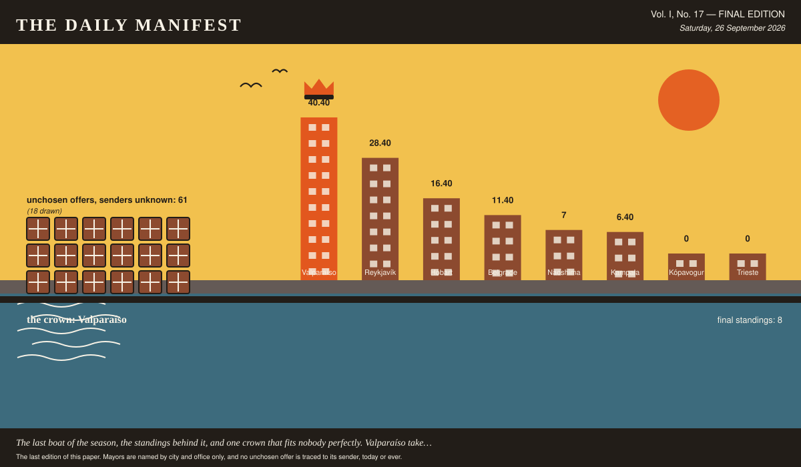

# The Daily Manifest

*All the news that fits in the hold.*

**Vol. I, No. 17 — FINAL EDITION** · Saturday, 26 September 2026 · Price: free to city halls, exorbitant to everyone else

Weather: fog. The ferries are running on confidence alone.

_The last edition of this paper. Mayors are named by city and office only, and no unchosen offer is traced to its sender, today or ever._

*The last boat of the season, the standings behind it, and one crown that fits nobody perfectly. Valparaíso takes it anyway.*

---

## The Crown

*Two rotations, 15 notices, and one column of numbers that will now be quoted locally for years.*

**Valparaíso takes the crown.** 40.40 in cumulative profit across 17 rounds, every unit of it awarded by somebody else.

The margin over Reykjavík was 12, which is one good roll and a small number of firmly held opinions.

The total is built on six chosen offers, each of them picked blind by a mayor who did not know where it came from.

| # | City | Final profit |
| --- | --- | --- |
| 1 | Valparaíso | 40.40 |
| 2 | Reykjavík | 28.40 |
| 3 | Hobart | 16.40 |
| 4 | Belgrade | 11.40 |
| 5 | Naoshima | 7 |
| 6 | Kampala | 6.40 |
| 7 | Kópavogur | 0 |
| 8 | Trieste | 0 |

_Final figures, cumulative from the first round, unadjusted for luck, weather, or the strength of anybody's feelings._

The other 7 delegations have been thanked in writing, at length, by a paper with column inches to spare.

_This paper thanks every city hall for its patience, its cargo and its opinions about this paper._

## Consequences

*A year of international goodwill has had effects. This desk has been asked to look into them.*

The trade is finished, the ledger is closed, and 18 things are now permanently in places that were not built for them. This paper has been to see most of them.

> Four hundred apple crates out of the Huon Valley, second-hand, dovetailed by people who expected them to be dropped, lined with hessian and drilled for drainage, filled two parts leaf mould to one part washed river grit. Planted: eight house leeks and a fistful of creeping thyme per box, plus chives, because chives forgive. What they forgive is neglect, salt, wind off the water, a fortnight with nothing at all, being frozen solid, being watered with the cold end of somebody's tea, and being carried indoors in October by a resident who has decided they look cold. What they do not forgive is daily watering, so we have written that on the underside of every crate where it cannot get lost.

Hobart wrote that. Reykjavík read it, wanted it, and took delivery of it against the notice titled "Window boxes for one long grey street".

It has taken to Reykjavík magnificently, in every direction, and through one wall.

> Forty thousand postcards, printed on card thick enough to stand up in a rack, and not one of them the view from the top of the mountain. The image is the town seen from the middle of the river on a grey afternoon, the mountain entirely inside a cloud, one ferry crossing left to right. Half our residents say this is a slander and we should have waited for a clear day; the other half say we have been waiting for a clear day since 1804 and this is the honest one. Both arguments are printed on the reverse in small type, so your shopkeeper has something to say instead of apologising.

Hobart wrote that. Valparaíso read it, wanted it, and took delivery of it against the notice titled "Postcards of somewhere else entirely".

Valparaíso has written to everybody it has ever met. Several of them have written back, which was not the plan.

> Sixteen crates, glass, returnable, all of it cold when it left. Twelve crates of *Bilz y Pap* — the pink one and the yellow one, and no living person can tell you what flavour either is meant to be; the label says only *sabor único*, a unique flavour, which is the most honest thing ever printed on a bottle. Two crates of *mote con huesillo* in bottle form, wheat and dried peach in syrup, labelled *más chilena que los porotos* — more Chilean than beans — and it is a drink you eat with a spoon at the end. Two crates of murta cordial from the south, whose label promises it is *digestivo y refrescante*, which we read as medicinal and therefore permission. And thirty-one bottle openers: eight of steel, twenty-two shaped like sardines, and one welded to a chain in the shape of our funicular, for the shop that keeps losing them.

Sent by Valparaíso, chosen by Kampala, filed under Soft Drinks & Fizz, and now a permanent feature of somewhere it has never been before.

Every fridge in Kampala is now one crate fuller than it was designed to be, and three doors no longer shut.

> Forty cases. Twenty-eight of paprika, which is what gets eaten here without anyone deciding to, ten of plain salted, and two of a barbecue flavour that exists mainly so there is something to reject. The bag is red and yellow and has not been redesigned since about 1985, and on the back it prints the weight in grams, a nutritional table nobody has ever read, and the name of the village the potatoes were grown in — population three hundred, also the factory address, and if you ring the number on it you get somebody's mother. Open one case immediately. They do not travel forever and I would rather you ate them than stored them.

Reykjavík wrote that. Kópavogur read it, wanted it, and took delivery of it against the notice titled "Crisps in a flavour nobody here has met".

Kópavogur has eaten it, formally, at a ceremony, and has put in a written request for more.

The industry Naoshima ramped up when nobody answered its notice has not been ramped back down. It has a logo, a rota and an opinion about the harbour.

Kópavogur's lapsed deliberation paid 5 cities at once, and 5 cities have since referred to it as a mandate.

None of the above is the half of it. Over the whole game 61 offers were sent and not chosen, and every one of them went home again: window boxes, planted, unwatered, postcards, written, never posted, seedlings, hardened off, unplanted, crates, warm, stacked in the shade, biscuits, broken, at the bottom of the tin, swimming kit, dry, folded, unused, sweets, unwrapped, going soft in the jar, rule sheets, for games nobody learned, coops, built, unoccupied, cake, cut, under a tea towel, prizes, unclaimed, back in the box, regional specialities, admired and uneaten and late suppers, arriving at the wrong hour. That is what the world made this year and could not give away.

The senders of the unwanted are not named here. They were not named at the time, they are not named at the end, and the last edition is not a late confession.

_No city hall has accepted responsibility for any of the above, which this paper regards as the most professional conduct of the entire game._

## The Excess

*One portrait per city, drawn from what it asked the world for, what the world kept, and what it could not find a use for.*

### Belgrade

*The portrait of Belgrade: notices, ribbons, leftovers, and one closed door.*

Belgrade, fourth on 11.40, drawn here from its own record and nobody else's.

Belgrade's notices this game: Biscuits, by the tin, for a hall with three bookings and The sweet nobody else has. Two in total, each one a thing it wanted and could not get at home.

Two of Belgrade's offers were chosen across the game, each of them picked by a mayor who did not know whose it was.

Chosen, in Naoshima, from Belgrade: *Five hundred small ones out of one stall in our biggest market, bought in a single afternoon of hard bargaining: wind-up tin frogs, plastic combs shaped like fish, whistles that do a convincing bird, keyring torches, magnets of a bridge nobody there will recognise, glitter hair clips in colours that do not occur in nature, and one hundred and forty foil-wrapped chocolate coins that must not go anywhere warm. Gaudy, plastic, faintly baffling — correct on all three counts, and I checked. The one good prize is a red 96-bass piano accordion, forty years old, mother-of-pearl on the keys, in a hard case with a strap that has been sweated into by better musicians than me; a man who repairs them for a living will tune and re-wax it the week before it ships. In the case there is a card with three tunes on it, and the third one is easy on purpose. Grown adults will queue in the rain. Sell them two tickets each.*

On Belgrade's own quay: eleven offers, arrived, read, and not chosen. All of it still there. The clerk's file calls the pile biscuits, broken, at the bottom of the tin and regional specialities, admired and uneaten.

From that pile, unattributed as ever:

- One tin, and I will tell you now it is not going to be like the other eleven. Ours is a hard, plain, rusk-coloured square, sixty to the tin, made to be eaten with butter and a slice of cheese thicker than the biscuit itself, and it is called, without any ceremony at all, the food biscuit. It survives a dunk the way a paving slab survives rain: completely, and without becoming any nicer for it. Dunk one for the swimming club's satisfaction, then butter a second one properly and see which side of the argument you come down on.
- One tin, kilo and a half, of *chilenitos*: two rounds of shortcrust barely thicker than a coin, glued with *manjar* — boiled milk caramel, dark, half a shade from burnt — and hatted with a dome of hard meringue. It does not survive a dunk. It does not survive being carried across a room. Dunk it and you will be holding a wet biscuit stump above a cup that has become dessert, which our position is that this was the intention all along and the swimming club will be the first to admit it. So the tin also contains a hundred *palitos de manjar*, finger-length caramel-filled tubes that are structurally serious, dunk twice, hold, and can be eaten one-handed while arguing about an allotment. Baked Tuesday by Señora Norma Ibarra, who has run the same oven for thirty-one years and asks only that you do not put them in the fridge.

Belgrade's own unchosen offers exist, are somewhere in Belgrade, and are nobody's business. The portrait draws the door and stops there.

For the record, the Mayor of Belgrade, asked *The mayoral position on coriander, please. For the record.*: “Against, and for the record it is chemistry, not taste. It comes at me like the inside of a new plastic bucket, and I'm told that reaction is genetic, which I choose to read as science taking my side rather than excusing me.”

### Hobart

*The portrait of Hobart: notices, ribbons, leftovers, and one closed door.*

Hobart finishes third, on 16.40, and looks — the illustrator is firm about this — exactly like a city that finished third on 16.40.

What Hobart asked for, in order: Something to eat off a balcony and The game your city plays in the street.

Three times this game, a city read an unsigned offer and it turned out to be Hobart's.

Reykjavík looked at a desk of unsigned offers and took Hobart's: *Four hundred apple crates out of the Huon Valley, second-hand, dovetailed by people who expected them to be dropped, lined with hessian and drilled for drainage, filled two parts leaf mould to one part washed river grit. Planted: eight house leeks and a fistful of creeping thyme per box, plus chives, because chives forgive. What they forgive is neglect, salt, wind off the water, a fortnight with nothing at all, being frozen solid, being watered with the cold end of somebody's tea, and being carried indoors in October by a resident who has decided they look cold. What they do not forgive is daily watering, so we have written that on the underside of every crate where it cannot get lost.*

Nine offers reached Hobart and went unchosen. Hobart kept the pile anyway — seedlings, hardened off, unplanted and rule sheets, for games nobody learned — because nobody has ever worked out how to send an offer back.

From that pile, unattributed as ever:

- Three hundred grow bags, three hundred terracotta pots the colour of our roof tiles, and eleven hundred seed packets hand-labelled by the ladies of the Cerro Alegre seed swap, who argue about basil the way other people argue about football. The two that actually survive a balcony: cherry tomatoes of the *cherry amarillo* strain, which fruit in a bucket of poor soil and sulk beautifully but never die, and rosemary — take a cutting the size of a pencil, push it into sand, forget about it entirely, and in a year it will be a small shrub that outlives the lease. Everything else in the crate is optimism: eighty dwarf lemon whips, chard, oregano, and mint you must keep in its own pot or it will annex the balcony next door. We have also included three hundred saucers, because a balcony that drips onto the balcony below is how neighbourhoods learn to hate each other.
- Three hundred grow bags sewn out of feed sacks by the ladies who sit outside the hardware shop, each one packed with a tin of cherry tomatoes already up two inches, and seed folded into little paper squares torn from exercise books — amaranth, basil, coriander for the brave, and pigeon pea if you want shade. Sixty dwarf pawpaw seedlings as well, which will fruit before anybody finishes discussing them. The two that actually survive a balcony are chilli and sukuma wiki, and I will tell you exactly why: the chilli enjoys being ignored, it gets hotter out of spite, and sukuma wiki you harvest one leaf at a time so it never dies, it only gets shorter and more apologetic. Everything else on a balcony is a hobby. Those two are food.

Hobart's own unchosen offers exist, are somewhere in Hobart, and are nobody's business. The portrait draws the door and stops there.

For the record, the Mayor of Hobart, asked *Name a thing everybody else loves that you have never understood.*: “Camping. I went to considerable trouble to own a house with a roof on it, and the proposal is that I go and sleep outside on purpose.”

### Kampala

*The portrait of Kampala: notices, ribbons, leftovers, and one closed door.*

Kampala finishes sixth, on 6.40, and looks — the illustrator is firm about this — exactly like a city that finished sixth on 6.40.

Kampala came to the world two times, over Something cold, in a glass bottle and Hens, and something to keep them in.

Two times this game, a city read an unsigned offer and it turned out to be Kampala's.

Chosen, in Kópavogur, from Kampala: *Forty cases coming, split three ways: twenty of cassava crisps sliced thin enough to read a newspaper through and salted while still spitting, fifteen of sweet plantain crisps that go dark at the edges and taste like toffee that changed its mind, and five of green banana crisps dusted with chilli and lime for people who need convincing. They are packed in brown paper bags hand-stamped at a printer's off the taxi park, and what is printed on the bag is a boda rider giving a thumbs up, the words EAT WHILE HOT, SHARE WHILE WARM, and a phone number. The number is mine. The printer put it there by mistake in 2019 and I have never corrected him, so if a bag disappoints you, ring me and I will answer.*

The excess at Kampala: nine offers, declined, filed under crates, warm, stacked in the shade and coops, built, unoccupied, occupying a quay that has other uses.

Two offers, reprinted without a sender, because the writing deserves a second reading:

- Sixty crates, all glass. Twenty of malt — dark, thick, tastes of bread and molasses, and the label has claimed for the better part of a century that it is nourishing and good for nursing mothers, a claim which has never been withdrawn and, as far as I can establish, never tested. Twenty of orange soda, because the two are poured half and half into the same glass at Christmas here by people who will argue with you about the ratio and mean it. Twenty of rhubarb cordial, under-sweetened to a degree some find startling. Plus a box of two hundred flat stamped openers, because you are right, nobody ever sends the opener.
- Sixty crates, all glass: sparkling apple pressed down the valley with nothing added, blackcurrant cordial thick enough to stand a spoon in, a pepperberry tonic that goes faintly numb at the back of the tongue, sarsaparilla, and a leatherwood honey soda that tastes the way a beehive smells. The label claims the water fell as rain on a mountain with nothing built on it and was in the bottle inside a day, which is true, and then claims it is the purest water in the world, which is a matter for lawyers. Four dozen openers, plain steel, each one spliced onto three feet of rope so it can be tied to the crate and stay tied to the crate.

What Kampala sent that nobody chose is not itemised here and cannot be: this paper has never known which offers were Kampala's, and the one ledger that does know is not something the last edition gets to open. There is a shed for it in the portrait, with the door shut.

On the question *Name a thing everybody else loves that you have never understood.*, Kampala's answer was: “Camping. You own a bed. You own a roof. You paid for both of them, and then you drive out of town to sleep on the ground and tell me about it for a week.”

### Kópavogur

*Kópavogur, drawn from its own year: what it asked the world for, what the world kept, and what is still on the quay.*

Kópavogur finishes joint seventh, on 0, and looks — the illustrator is firm about this — exactly like a city that finished joint seventh on 0.

What Kópavogur asked for, in order: Crisps in a flavour nobody here has met and Cake for a birthday nobody will admit to.

Kópavogur appears nowhere in the year's arrivals. The paper offers no theory and has several.

One of Kópavogur's decisions was made by the clock instead, to the profit of 5 cities.

The excess at Kópavogur: six offers, declined, filed under cake, cut, under a tea towel, occupying a quay that has other uses.

Two offers, reprinted without a sender, because the writing deserves a second reading:

- Three kinds, since a four-hundredth should not be one kind. Twenty tall ones: eleven thin layers with rhubarb jam between, sliced thinner than you think is generous, the cake made here when you cannot think what else to give a person. Forty flat ones, baked in the tray they are cut in, cocoa icing and desiccated coconut, and the tray goes home with somebody who is expected to return it. Twelve soaked in enough of something that you should warn the choir before it sings. Two hundred boxes with string, thirty kilos of icing in six colours and sixty piping bags — enough nonsense for four hundred years with a margin left over for the arguing about it.
- Three cakes for four hundred years. Tall is a six-tier leatherwood honey cake, dry-stacked so it travels; flat is eight trays of raspberry and blackcurrant slab off fruit picked forty minutes from here and not out of a tin; soaked is one eleven-kilo fruit cake that has had a capful of local single malt every Sunday since your notice went up and needs no further assistance from anybody. Twelve waxed boxes with string handles that hold together in rain, twenty-two kilos of royal icing, sixty piping bags. Beryl comes with it: she can pipe legible cursive upside down on a wobbling trestle table and will write whatever you tell her to, having heard worse.

Kópavogur's own unchosen offers exist, are somewhere in Kópavogur, and are nobody's business. The portrait draws the door and stops there.

For the record, the Mayor of Kópavogur, asked *Name a thing everybody else loves that you have never understood.*: “The northern lights. Half the town drives out to stand in a freezing ditch and comes back altered; I have looked up, seen green, said "yes, green," and gone in for my supper.”

### Naoshima

*Naoshima at the end of the game, with 6 declined offers behind it and the shed door shut on the rest.*

Fifth: Naoshima, 7, and a harbour that has seen things this year.

Naoshima came to the world two times, over Board games for a wet fortnight and Prizes for a fête, and nothing sensible.

Nothing in this paper's whole arrivals column came from Naoshima. The column is the poorer for it and has said so.

Naoshima once put out a notice the whole world ignored, and then quietly did it itself, at full price.

On Naoshima's own quay: six offers, arrived, read, and not chosen. All of it still there. The clerk's file calls the pile prizes, unclaimed, back in the box.

From that pile, unattributed as ever:

- Five hundred plastic puffins on keyrings. They squeak, they are made nowhere near here and sold on every street here, and grown adults will complain about them and then take three. The one good prize is a hand-knitted wool sweater with the yoke pattern, undyed grey and cream, made by Guðrún Sigurjónsdóttir, seventy-four, of the Grafarvogur estate, who takes three weeks over one and has never sold a single one in her life. It will keep the rain off you for forty years, which the puffins will not do for eleven minutes. Draw that raffle last, and outdoors.
- Five hundred small gaudy prizes, and every one of them is a thing our port already makes too many of: two hundred tin sardines with a hinged tail that clack when you shake them, hand-painted in nine colours; a hundred and fifty miniature funicular cars, wooden, the size of a matchbox, wheels that actually roll; a hundred rubber stray dogs, because we have thirty thousand real ones and the children over there deserve at least a hundred; and fifty enamel pins of a staircase going nowhere. All of it faintly baffling, which was the brief and is also our municipal character. And the one prize: a working hand-cranked barrel organ, *organillo*, restored by the Lizana family who have kept the last three in this country alive, with forty-one tunes on the barrel and a strap so a child can carry it — and whoever pulls the winning ticket is taught to play it, on the spot, in the rain, badly, in front of everybody. Grown adults will queue. They queue here.

Naoshima's own unchosen offers exist, are somewhere in Naoshima, and are nobody's business. The portrait draws the door and stops there.

For the record, the Mayor of Naoshima, asked *What compliment do you actually want to receive?*: “That a room I made decisions about was quiet. Not beautiful. Quiet.”

### Reykjavík

*Reykjavík at the end of the game, with 7 declined offers behind it and the shed door shut on the rest.*

Second: Reykjavík, 28.40, and a harbour that has seen things this year.

Reykjavík came to the world two times, over Window boxes for one long grey street and Outfitting for a swimming club that swims in March.

Five of Reykjavík's offers were chosen across the game, each of them picked by a mayor who did not know whose it was.

Hobart looked at a desk of unsigned offers and took Reykjavík's: *Thirty balls of the soft-seamed sort that will not go through a window, and thirty sticks of chalk you will not end up needing. The game is called yfir — 'over' — and it is played against a roof rather than a wall, which puts us, by my count, one storey ahead of you. Two teams stand either side of a house; you shout the name of the game, throw the ball over the ridge, and if the far side catches it they come round the corner at speed and the running begins. Coming to demonstrate: Sigrún Halldórsdóttir, sixty-eight, school caretaker for thirty-one years and the only authority anyone accepts on whether a throw counted. She has asked for an afternoon with some wind in it; a car park is fine.*

Seven offers reached Reykjavík and went unchosen. Reykjavík kept the pile anyway — window boxes, planted, unwatered and swimming kit, dry, folded, unused — because nobody has ever worked out how to send an offer back.

From that pile, unattributed as ever:

- Four hundred window boxes, and every one of them is a decommissioned zinc gutter section off our hills, cut to ninety centimetres, hammered flat at the ends and painted by hand — no two the same colour, because we ran out of everything except confidence. Filled with compost cut with volcanic grit, and planted with nasturtium, geranium and the trailing succulent our grandmothers call *siempreviva*: it forgives drought, it forgives darkness, it forgives being ignored from October to March, and it forgives the man who tips his coffee dregs into it every morning because it rather enjoys that. Nine hundred metres of grey render is not a street, it is a primed canvas that nobody has had the nerve to sign. We are sending the nerve in four hundred pieces.
- Four hundred window boxes, already loaded, and none of them bought: Ssalongo the tinsmith and his three nephews cut old jerrycans lengthwise, hammered the edges flat, drilled the drainage and painted every one a different colour, so your nine hundred metres of grey will look like a market stall from one end to the other. Eight tonnes of compost on top of that, coffee husk mixed with sweepings from a market that starts at four in the morning, and in each box: mother-in-law's tongue, aloe, and a spider plant cutting. What they forgive is everything — a fortnight's holiday, a dark window, cold glass, being watered with tea, being watered with nothing at all from March until whenever you remember. Aloe will forgive you so completely it will have had babies by the time you notice it.

Reykjavík's own unchosen offers exist, are somewhere in Reykjavík, and are nobody's business. The portrait draws the door and stops there.

On the question *Name a thing everybody else loves that you have never understood.*, Reykjavík's answer was: “Barbecue as an occasion. I understand the food. I have never understood standing outdoors in a group for ninety minutes, waiting on it, everyone agreeing the wind is part of the charm.”

### Trieste

*The portrait of Trieste: notices, ribbons, leftovers, and one closed door.*

Joint eighth: Trieste, 0, and a harbour that has seen things this year.

What Trieste asked for, in order: The thing you eat standing up at eleven at night.

Trieste appears nowhere in the year's arrivals. The paper offers no theory and has several.

The excess at Trieste: six offers, declined, filed under late suppers, arriving at the wrong hour, occupying a quay that has other uses.

From that pile, unattributed as ever:

- Two hundred lamb sausages, vacuum-packed and frozen; twelve tubs of remoulade; six tins of sweet brown mustard; four kilos of crisp fried onion in sealed bags; and a sack of raw onion, which you chop small yourself. That is one snack, assembled in that order at a kiosk window at eleven at night, and it is eaten out of a folded paper napkin, standing up, with your back to whatever the wind is doing. Also two crates of dried fish in strips, vacuum-packed, and a pound of butter: no cooking, no plate, you tear a piece, butter it, and eat it out of your own hand. Both keep for months. Neither of them wants a table, which I understand is the whole point of eleven o'clock.
- Three hundred curried scallop pies, frozen hard, packed in dry ice: shortcrust, a yellow sauce the exact colour of a wet raincoat, and scallops out of the channel rather than out of a bag from somewhere else. They are eaten standing on a wharf at eleven at night out of a flat white paper bag folded down twice, back to the wind, sauce running towards the wrist, which is the point rather than the fault. Two thousand bags in the crate, and four hundred wooden forks nobody will use. Twenty minutes in a real oven; whoever microwaves one has ended the exercise for everybody.

What Trieste sent that nobody chose is not itemised here and cannot be: this paper has never known which offers were Trieste's, and the one ledger that does know is not something the last edition gets to open. There is a shed for it in the portrait, with the door shut.

For the record, the Mayor of Trieste, asked *Good news arrives. Who do you call first?*: “Nobody, for about an hour. I take it down to the counter at the café and say it out loud to a man who has heard better news than mine and doesn't look up — then I call my sister, who asks what the catch is.”

### Valparaíso

*The portrait of Valparaíso: notices, ribbons, leftovers, and one closed door.*

Valparaíso finishes first, on 40.40, and looks — the illustrator is firm about this — exactly like a city that finished first on 40.40.

Valparaíso's notices this game: Postcards of somewhere else entirely and Nine hundred paper bags, and something to put in them. Two in total, each one a thing it wanted and could not get at home.

Six times this game, a city read an unsigned offer and it turned out to be Valparaíso's.

The world kept this, from Valparaíso: *Kópavogur, *querido* — four hundred years and only cake? Valparaíso salutes the discipline. Loading tomorrow on the *ascensor* Artillería, hand-cranked down the hill by Doña Inés Carvajal, who has been baking on Cerro Alegre through four earthquakes, eleven winters of horizontal rain and three changes of paint on the same bakery wall, and has never once let a *torta* fall: eighteen tall *tortas de mil hojas*, forty layers each, thin as a gull's patience; twenty-four flat almond *kuchen* from the German bakers down at Puerto Varas, my cousins by marriage and rivals by nature; and nine *borrachos* soaked in *pisco* until they can barely stand, much like certain councillors after our budget votes. The boxes: three hundred, corrugated, painted by the mural collective of Cerro Concepción in the exact blues we use on the funicular sheds, so your rubbish bins will look better than most of our streets. Icing: sixty kilos, twelve colours, enough to write nonsense until 2426. Eat the *borrachos* first. They travel badly and improve everything.* — chosen in Kópavogur.

The excess at Valparaíso: seven offers, declined, filed under postcards, written, never posted and sweets, unwrapped, going soft in the jar, occupying a quay that has other uses.

From that pile, unattributed as ever:

- Forty thousand postcards, printed on a matte stock that will not curl in a damp rack. Thirty-eight thousand of them show the harbour, the church and the coloured roofs, which is what visitors buy and which nobody here argues about. The other two thousand show a wet street at half past eight on a January morning, steam coming up off the pavement where the hot-water pipes run underneath it, photographed from inside a bus shelter. Half the town says that is the only honest picture ever taken of us; the other half says it is a photograph of a puddle and some plumbing. They are both correct, which is why it is the one worth forty thousand of anything.
- Forty thousand matte postcards, 100 by 150, card thick enough that a cheap pen doesn't skid. They are two crops of one photograph, twenty thousand each: the church hill at nine in the evening with the capital's skyline sitting behind it, and the identical shot cropped one centimetre higher, so the skyline is gone and there is only our own roofline and a great deal of sky. Our residents have not agreed since 1994 on which of those is the real picture of the town, and they will not settle it for your shopkeeper either. Which pile goes at the front of the rack is entirely his business, and he should know that either choice offends somebody.

What Valparaíso sent that nobody chose is not itemised here and cannot be: this paper has never known which offers were Valparaíso's, and the one ledger that does know is not something the last edition gets to open. There is a shed for it in the portrait, with the door shut.

On the question *Name a thing everybody else loves that you have never understood.*, Valparaíso's answer was: “Swimming in the sea. I have lived my entire life eighty metres above it and I have been in it twice, neither time on purpose.”

_That is the world, as far as this paper was able to establish it, and establishing it was the whole job._

---

_The Daily Manifest. The final edition. There is no notice open, no window closing, and nothing further to send._
