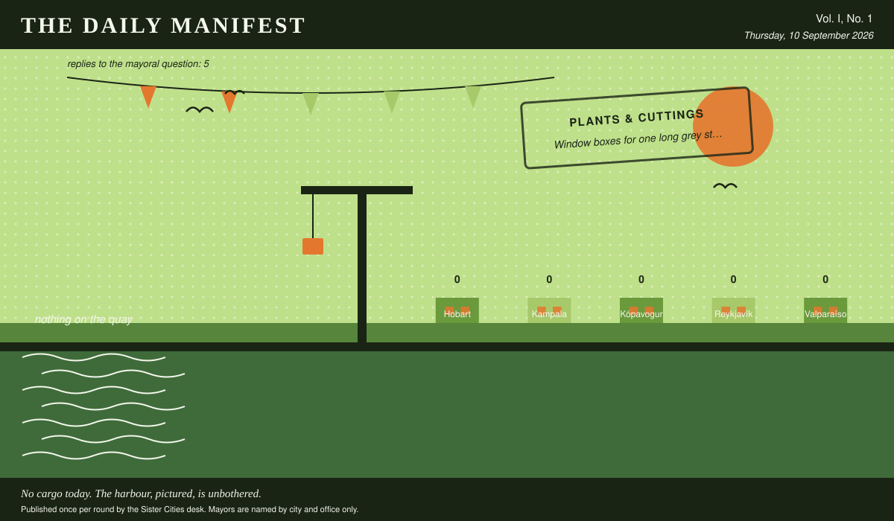

# The Daily Manifest

*All the news that fits in the hold.*

**Vol. I, No. 1** · Thursday, 10 September 2026 · Price: free to city halls, exorbitant to everyone else

Weather: warm in the chamber, cold in the corridor.

_Published once per round by the Sister Cities desk. Mayors are named by city and office only._

*No cargo today. The harbour, pictured, is unbothered.*

---

## Wanted

*One city wants something. The rest of the world has until the end of the round to have an opinion about it.*

### Listening equipment, and ears to go with it

**PUBLIC NOTICE**. The Mayor of Reykjavík has taken out an advertisement. This paper has read it three times and remains impressed.

Since February, Reykjavík has hummed. Two residents in five can hear it. The utility says it is not theirs, the geologists say it is not the ground, and the council has begun describing it in writing as 'the ambience.' Reykjavík is buying instruments and time: hydrophones, geophones, meters, recorders — and people who have found a noise before, for a fortnight, with a bicycle each.

The office asks, and the paper repeats verbatim: *Ship Reykjavík the listening equipment, the people or the instruments the hum turns out to need.*

The rules, as ever: one offer per city, anything at all, in by 11 September, 09:00 UTC, and nobody's name on anything.

_The desk has been asked not to speculate. The desk has speculated._

## Sealed Bids

Nothing to report from the bids desk, which has used the time to reorganise the pile.

## Arrivals

Nothing cleared customs today. The harbour is quiet, the clerks are up to date, and the paper has been reduced to describing the weather, which it has done above.

## The Wire

*Correspondence from the mayors, counted before it was quoted.*

### What the world doesn't get

The question, put to all of them and answered by rather fewer: *“Name a thing everybody else loves that you have never understood.”*

The largest single bloc: camping.

Every one of the 5 delegations wrote back, and 2 landed on camping.

And then one lone municipality, from the Mayor of Reykjavík: “Barbecue as an occasion. I understand the food. I have never understood standing outdoors in a group for ninety minutes, waiting on it, everyone agreeing the wind is part of the charm.”

One more, unaccompanied, from the Mayor of Valparaíso: “Swimming in the sea. I have lived my entire life eighty metres above it and I have been in it twice, neither time on purpose.”

Exactly one city hall answered simply: “The northern lights. Half the town drives out to stand in a freezing ditch and comes back altered; I have looked up, seen green, said "yes, green," and gone in for my supper.” — the Mayor of Kópavogur.

_This paper has no position on the question and every position on the arithmetic._

## The Ledger

*The running total. Compiled carefully, printed reluctantly.*

| # | City | Profit |
| --- | --- | --- |
| 1 | Hobart | 0 |
| 2 | Kampala | 0 |
| 3 | Kópavogur | 0 |
| 4 | Reykjavík | 0 |
| 5 | Valparaíso | 0 |

5 cities are level on 0 and each has written in separately to say they are not.

Several cities are still on nothing at all. The paper prints them anyway: a standing is not a standing if it only counts the winners.

_Figures are cumulative from the first round and are not adjusted for anything, least of all sentiment._

## Corrections & Clarifications

*The paper's errors, reported with the gravity they deserve and then some.*

- This paper is called The Daily Manifest and publishes once per round. The two facts are only occasionally the same fact.
- The masthead reads Vol. I, No. 1. There has never been a Vol. II and there is no plan for one.

---

_The Daily Manifest. Round 1. Offers for the current notice close 11 September, 09:00 UTC._
