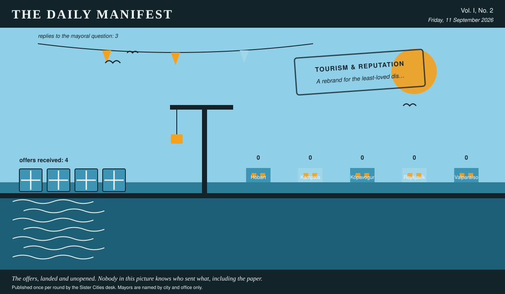

# The Daily Manifest

*All the news that fits in the hold.*

**Vol. I, No. 2** · Friday, 11 September 2026 · Price: whatever you have in the coat you wore yesterday

Weather: wind from the harbour, opinions from everywhere.

_Published once per round by the Sister Cities desk. Mayors are named by city and office only._

*The offers, landed and unopened. Nobody in this picture knows who sent what, including the paper.*

---

## Wanted

*The classifieds desk has been busy. It has taken one advertisement.*

### Something for Northgate, worth the bus fare

**PUBLIC NOTICE** from Valparaíso, paid for in municipal goodwill and printed here at length because the paper had the room.

Everyone in Valparaíso agrees the Northgate district is the worst part of town. Nobody who says this has been to Northgate since 2009. Northgate, meanwhile, has quietly become quite good. Valparaíso has a building, a budget and no stock: it is buying plant, fittings, equipment or the staff to run one thing in Northgate that people from the other side of town would travel for.

The notice ends with a question, which this paper considers the interesting part: *Ship Valparaíso the plant, fittings or people for one thing in Northgate worth the bus fare.*

Offers close at the end of this round (12 September, 09:00 UTC). One per city hall, freeform, sealed. Which city sent which will not be printed here, and will not reach the Mayor of Valparaíso either.

_What outsiders say about us when we leave the room is, unfortunately, printable._

## Sealed Bids

4 sealed offers, one desk, and the Mayor of Reykjavík sitting behind the lot of it.

Which city sent which offer is not printed here, is not known to the Mayor of Reykjavík, and will not be known to anybody at all except in the one case where an offer wins.

The Mayor of Reykjavík has until the end of this round to choose. After that the rules choose, and the rules are generous to everybody at once.

## Arrivals

No arrivals. The quay is swept, the crane is idle, and two gulls have taken the opportunity to occupy a bollard each.

## The Wire

*The paper puts one question to every city hall each round and prints what comes back, in aggregate, with the arithmetic showing.*

### What the world shows you first

Asked of every mayor on the register: *“Mayor, a visitor has four hours and no plan. What do you show them first?”*

Put to the great majority of city halls, the answer comes back: the city seen from a distance.

3 of 5 city halls wrote back. 2 of those said the city seen from a distance.

And then exactly one city hall, from the Mayor of Kópavogur: “The pool. Not the swimming — the hot tubs, in order, hottest last, where four hours is exactly long enough to learn everything worth knowing about this place from men who will tell you for free. Everyone assumes I'll drive them straight to the capital instead. It's eight minutes on the bus, they can manage that themselves later.”

_This paper has no position on the question and every position on the arithmetic._

## The Ledger

*Where everybody stands, in the only currency this game recognises.*

| # | City | Profit |
| --- | --- | --- |
| 1 | Hobart | 0 |
| 2 | Kampala | 0 |
| 3 | Kópavogur | 0 |
| 4 | Reykjavík | 0 |
| 5 | Valparaíso | 0 |

5 cities are level on 0 and each has written in separately to say they are not.

Several cities are still on nothing at all. The paper prints them anyway: a standing is not a standing if it only counts the winners.

_Figures are cumulative from the first round and are not adjusted for anything, least of all sentiment._

## Corrections & Clarifications

*The paper's errors, reported with the gravity they deserve and then some.*

- The Wire item above rests on 3 replies out of 5 city halls. The paper prefers to say so in two places than in none.
- The paper's accountants remain volunteers. The paper's accountants remain, in the paper's view, heroes.

---

_The Daily Manifest. Round 2. Offers for the current notice close 12 September, 09:00 UTC._
