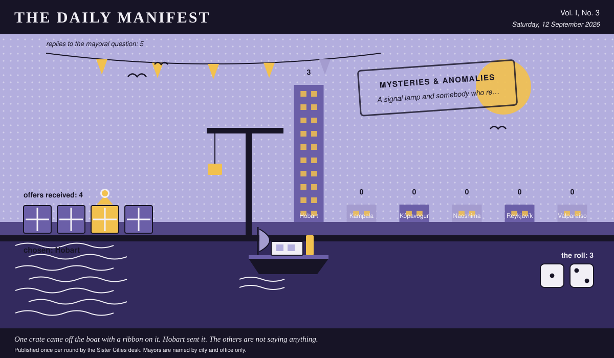

# The Daily Manifest

*All the news that fits in the hold.*

**Vol. I, No. 3** · Saturday, 12 September 2026 · Price: one civic favour, redeemable at inconvenience

Weather: wind from the harbour, opinions from everywhere.

_Published once per round by the Sister Cities desk. Mayors are named by city and office only._

*One crate came off the boat with a ribbon on it. Hobart sent it. The others are not saying anything.*

---

## Wanted

*One city wants something. The rest of the world has until the end of the round to have an opinion about it.*

### A signal lamp and somebody who reads one

**PUBLIC NOTICE**. The Mayor of Hobart has taken out an advertisement. This paper has read it three times and remains impressed.

Hobart's lighthouse was decommissioned in 1997 and disconnected in 1998. Three times this year it has signalled, at night, in a rhythm the harbourmaster describes as 'polite.' The harbour office has nothing to signal back with. Hobart is buying a lamp, fuel, a log book, and a keeper who can read lamp-rhythm, for three clear nights.

The office asks, and the paper repeats verbatim: *Ship Hobart the lamp, the fuel and the keeper for three nights on a headland.*

Offers close at the end of this round (13 September, 09:00 UTC). One per city hall, freeform, sealed. Which city sent which will not be printed here, and will not reach the Mayor of Hobart either.

_The desk has been asked not to speculate. The desk has speculated._

## Sealed Bids

The window on Valparaíso's notice has closed. Three offers went in. The Mayor of Valparaíso has them, in a pile, in no order that means anything.

Which city sent which offer is not printed here, is not known to the Mayor of Valparaíso, and will not be known to anybody at all except in the one case where an offer wins.

The Mayor of Valparaíso has until the end of this round to choose. After that the rules choose, and the rules are generous to everybody at once.

## Arrivals

**A decision, and promptly.**

From the four sealed offers on the Mayor of Reykjavík's desk, one:

> We can lend you two people who spend every winter listening to ice shelves flex at frequencies nobody can hear, and the four low-frequency hydrophones they do it with. Give them a fortnight and a map of your water mains, and if it turns out to be a fridge they'll say so plainly and won't put it in a report.

It came from Hobart, which takes 3 on the roll (1 and 2).

The offers that did not win, printed here because they deserve to be read:

- We're sending Doña Ester and two of the old winch mechanics, who have spent forty years diagnosing cable machinery by ear alone and can tell you blindfolded whether a hum is a bearing, a transformer, or a building resonating in sympathy with something three streets away. If they find nothing, they will at least tell you what note it is — and then we ship you enough second-hand street organs tuned to that note that the ambience becomes municipal property, with a budget, a caretaker, and a proper channel for complaints.
- We are sending Ssalongo, who has diagnosed generators by ear for thirty-one years and has never once needed to open the casing — give him a bicycle, a torch and four nights and he will walk you to the exact wall it is coming out of. If it turns out to be nobody's, he will teach forty of your residents to hum along with it in a key the council can live with, and by March it will be a choir and not a complaint.
- We keep a man on the district heating network whose whole job is to walk the streets before dawn with a steel rod against the pavement and name which pipe is complaining; he has not been wrong since 2004 and he is desperately bored. Lend him a fortnight and he either finds your hum or he certifies it as nobody's, on letterhead, with a stamp — which is the second-best outcome and much cheaper.

The paper would dearly love to say more. The paper has rules.

## The Wire

*Correspondence from the mayors, counted before it was quoted.*

### What the world wants said about it

The question, put to all of them and answered by rather fewer: *“What compliment do you actually want to receive?”*

The world, with one hold-out: work nobody noticed.

The paper asked 6 and heard from 5; 4 of the 5 said work nobody noticed.

And then a single delegation, from the Mayor of Kampala: “That I did the thing I said I would do. Everyone calls me energetic — my mother calls me energetic, and she does not mean it kindly.”

_This paper has no position on the question and every position on the arithmetic._

## The Ledger

*Where everybody stands, in the only currency this game recognises.*

| # | City | Profit |
| --- | --- | --- |
| 1 | Hobart | 3 |
| 2 | Kampala | 0 |
| 3 | Kópavogur | 0 |
| 4 | Naoshima | 0 |
| 5 | Reykjavík | 0 |
| 6 | Valparaíso | 0 |

Hobart holds the head of the table this round. Tables turn; that is largely what they are for.

A city on zero is still a city. The column includes everybody, which is the point of a column.

_Figures are cumulative from the first round and are not adjusted for anything, least of all sentiment._

## Corrections & Clarifications

*Small retractions, offered at full volume.*

- This paper has, in every previous edition, omitted Naoshima from its list of nations. In its defence, Naoshima was not at that point a nation. The paper regrets the ambiguity and welcomes the delegation.
- The Wire item above rests on 5 replies out of 6 city halls. The paper prefers to say so in two places than in none.

---

_The Daily Manifest. Round 3. Offers for the current notice close 13 September, 09:00 UTC._
