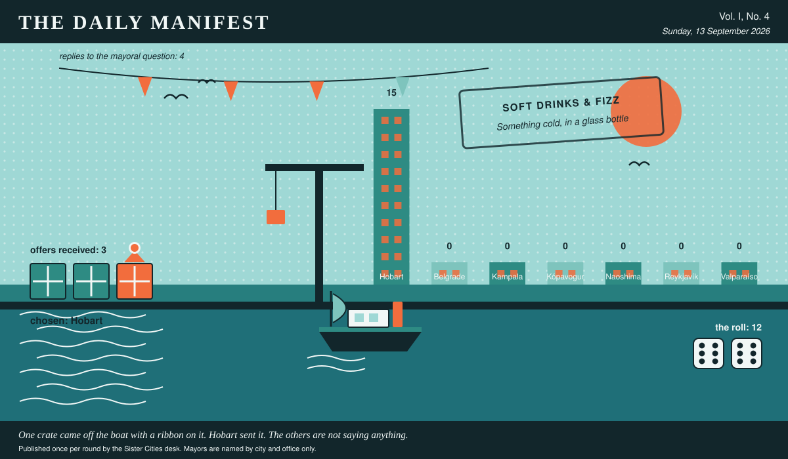

# The Daily Manifest

*All the news that fits in the hold.*

**Vol. I, No. 4** · Sunday, 13 September 2026 · Price: free to city halls, exorbitant to everyone else

Weather: bright, briefly, and then a meeting.

_Published once per round by the Sister Cities desk. Mayors are named by city and office only._

*One crate came off the boat with a ribbon on it. Hobart sent it. The others are not saying anything.*

---

## Wanted

*One city wants something. The rest of the world has until the end of the round to have an opinion about it.*

### Something cold, in a glass bottle

**PUBLIC NOTICE**, filed by the Mayor of Kampala under Soft Drinks & Fizz, which is where Kampala files most things.

The corner shops in Kampala sell three colas, and they are the same three colas sold everywhere else on earth. The town has decided this is a poverty. Wanted: cordials, sodas, tonics, sparkling anything, in glass, by the crate -- the stranger the flavour the better -- and a bottle opener, because nobody ever sends the opener.

The office asks, and the paper repeats verbatim: *Ship Kampala crates of cold bottled drinks, and say what the label claims about them.*

Every other city hall may send exactly one offer, in whatever form it likes, by 14 September, 09:00 UTC. The offers arrive unsigned, and the Mayor of Kampala will read them that way.

_This desk holds that a drink is only cold if the bottle sweats, and has held that position loudly._

## Sealed Bids

The window on Hobart's notice has closed. Five offers went in. The Mayor of Hobart has them, in a pile, in no order that means anything.

The offers are unsigned. That is not the paper being coy; it is the rule, and it holds after the vote as firmly as before it.

One round to decide. A window that closes without a decision is not a disaster, merely an expensive kind of politeness.

## Arrivals

**A decision, and promptly.**

The winning offer for Valparaíso, reproduced exactly as it arrived:

> Forty thousand postcards, printed on card thick enough to stand up in a rack, and not one of them the view from the top of the mountain. The image is the town seen from the middle of the river on a grey afternoon, the mountain entirely inside a cloud, one ferry crossing left to right. Half our residents say this is a slander and we should have waited for a clear day; the other half say we have been waiting for a clear day since 1804 and this is the honest one. Both arguments are printed on the reverse in small type, so your shopkeeper has something to say instead of apologising.

The sender, now nameable because they won: Hobart. Profit: 12, on 6 and 6.

Also offered, and declined:

- Forty thousand postcards, printed on a matte stock that will not curl in a damp rack. Thirty-eight thousand of them show the harbour, the church and the coloured roofs, which is what visitors buy and which nobody here argues about. The other two thousand show a wet street at half past eight on a January morning, steam coming up off the pavement where the hot-water pipes run underneath it, photographed from inside a bus shelter. Half the town says that is the only honest picture ever taken of us; the other half says it is a photograph of a puddle and some plumbing. They are both correct, which is why it is the one worth forty thousand of anything.
- Forty thousand matte postcards, 100 by 150, card thick enough that a cheap pen doesn't skid. They are two crops of one photograph, twenty thousand each: the church hill at nine in the evening with the capital's skyline sitting behind it, and the identical shot cropped one centimetre higher, so the skyline is gone and there is only our own roofline and a great deal of sky. Our residents have not agreed since 1994 on which of those is the real picture of the town, and they will not settle it for your shopkeeper either. Which pile goes at the front of the rack is entirely his business, and he should know that either choice offends somebody.

This paper is not saying who sent those, now or ever. Neither is the Mayor of Valparaíso, who does not know.

## The Wire

*The paper puts one question to every city hall each round and prints what comes back, in aggregate, with the arithmetic showing.*

### The coriander question

Asked of every mayor on the register: *“The mayoral position on coriander, please. For the record.”*

The great majority of city halls — in favour, and not a great deal of argument about it.

Of the 4 delegations that replied — the paper asked 7 — 3 named in favour.

Exactly one city hall answered simply: “Against, and for the record it is chemistry, not taste. It comes at me like the inside of a new plastic bucket, and I'm told that reaction is genetic, which I choose to read as science taking my side rather than excusing me.” — the Mayor of Belgrade.

_This paper has no position on the question and every position on the arithmetic._

## The Ledger

*Where everybody stands, in the only currency this game recognises.*

| # | City | Profit |
| --- | --- | --- |
| 1 | Hobart | 15 |
| 2 | Belgrade | 0 |
| 3 | Kampala | 0 |
| 4 | Kópavogur | 0 |
| 5 | Naoshima | 0 |
| 6 | Reykjavík | 0 |
| 7 | Valparaíso | 0 |

Hobart is top of the column. The column is long and the game is not over.

A city on zero is still a city. The column includes everybody, which is the point of a column.

_Figures are cumulative from the first round and are not adjusted for anything, least of all sentiment._

## Corrections & Clarifications

*The paper's errors, reported with the gravity they deserve and then some.*

- This paper has, in every previous edition, omitted Belgrade from its list of nations. In its defence, Belgrade was not at that point a nation. The paper regrets the ambiguity and welcomes the delegation.
- The Wire item above rests on 4 replies out of 7 city halls. The paper prefers to say so in two places than in none.

---

_The Daily Manifest. Round 4. Offers for the current notice close 14 September, 09:00 UTC._
