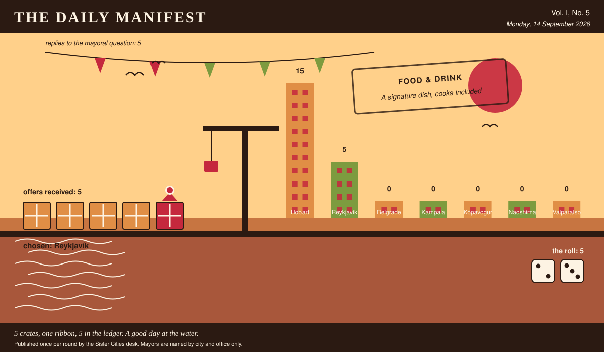

# The Daily Manifest

*All the news that fits in the hold.*

**Vol. I, No. 5** · Monday, 14 September 2026 · Price: free to city halls, exorbitant to everyone else

Weather: unsettled, like the minutes of the last session.

_Published once per round by the Sister Cities desk. Mayors are named by city and office only._

*5 crates, one ribbon, 5 in the ledger. A good day at the water.*

---

## Wanted

*Today's notice, printed in full and without comment, followed immediately by comment.*

### Crisps in a flavour nobody here has met

**PUBLIC NOTICE**, lodged at this paper's counter by the office of the Mayor of Kópavogur, who declined to elaborate.

The crisp shelf in Kópavogur offers salt, salt and vinegar, and a third bag that has been there since spring. The rest of the world, meanwhile, is out there putting prawn, paprika, seaweed and worse into packets. Wanted: forty cases of the crisps your city eats without thinking about it.

The Mayor of Kópavogur would like an answer to this: *Ship Kópavogur forty cases of your own city's crisps, and say what is printed on the bag.*

Offers close at the end of this round (15 September, 09:00 UTC). One per city hall, freeform, sealed. Which city sent which will not be printed here, and will not reach the Mayor of Kópavogur either.

_The desk has been asked not to speculate. The desk has speculated._

## Sealed Bids

5 sealed offers, one desk, and the Mayor of Kampala sitting behind the lot of it.

The offers are unsigned. That is not the paper being coy; it is the rule, and it holds after the vote as firmly as before it.

One round to decide. A window that closes without a decision is not a disaster, merely an expensive kind of politeness.

## Arrivals

**Hobart has picked.**

The Mayor of Hobart read 5 unsigned offers and marked one of them:

> Three hundred grow bags, three hundred pots of chives, six hundred packets of seed, forty dwarf apples that will sulk at you for a year, and thirty rhubarb crowns lifted out of gardens here where they had become a problem for their owners. Everything in the consignment was raised in a wind that regularly removes fence panels, so a balcony will feel like a holiday to it. The two that survive are chives and rhubarb: the chives because you can cut them to the soil in a gale and have them back in a fortnight, the rhubarb because nothing has ever successfully killed a rhubarb. Plant the tomatoes anyway. Everybody does.

Reykjavík sent it, and Reykjavík takes 5 — the dice said 2 and 3.

Not chosen, and not attributed:

- Three hundred grow bags, three hundred terracotta pots the colour of our roof tiles, and eleven hundred seed packets hand-labelled by the ladies of the Cerro Alegre seed swap, who argue about basil the way other people argue about football. The two that actually survive a balcony: cherry tomatoes of the *cherry amarillo* strain, which fruit in a bucket of poor soil and sulk beautifully but never die, and rosemary — take a cutting the size of a pencil, push it into sand, forget about it entirely, and in a year it will be a small shrub that outlives the lease. Everything else in the crate is optimism: eighty dwarf lemon whips, chard, oregano, and mint you must keep in its own pot or it will annex the balcony next door. We have also included three hundred saucers, because a balcony that drips onto the balcony below is how neighbourhoods learn to hate each other.
- Three hundred grow bags sewn out of feed sacks by the ladies who sit outside the hardware shop, each one packed with a tin of cherry tomatoes already up two inches, and seed folded into little paper squares torn from exercise books — amaranth, basil, coriander for the brave, and pigeon pea if you want shade. Sixty dwarf pawpaw seedlings as well, which will fruit before anybody finishes discussing them. The two that actually survive a balcony are chilli and sukuma wiki, and I will tell you exactly why: the chilli enjoys being ignored, it gets hotter out of spite, and sukuma wiki you harvest one leaf at a time so it never dies, it only gets shorter and more apologetic. Everything else on a balcony is a hobby. Those two are food.
- Three hundred grow bags, three hundred twenty-litre pots, nine hundred seed packets — chervil, dill, rocket, and a stubby outdoor tomato called Sub-Arctic Plenty, which is exactly what it sounds like — and forty dwarf apples on the smallest rootstock we could get. The two that actually survive a balcony are chives and rhubarb, so both go in bulk: six hundred chive clumps split out of one allotment over three weekends, and three hundred rhubarb crowns, which will outlive the balcony, the flat, and probably the building. Everything else on that list is optional entertainment; those two are the reason there will still be something edible up there in year four.

This paper is not saying who sent those, now or ever. Neither is the Mayor of Hobart, who does not know.

## The Wire

*The paper puts one question to every city hall each round and prints what comes back, in aggregate, with the arithmetic showing.*

### What the world is burying

This paper put the same question to every city hall: *“Your city is burying a time capsule. What do you put in it personally?”*

More capitals than name anything else — something of my father's, and not a great deal of argument about it.

Of the 5 delegations that replied — the paper asked 7 — 2 named something of my father's.

A single delegation answered simply: “My original application form, where I had written the name of the town next door in the box, and the extremely kind letter that came back explaining it was taken. Let some future archivist work out how I felt about it, because I'm still not sure.” — the Mayor of Kópavogur.

Exactly one city hall — the Mayor of Hobart — wrote only this: “A metre of the eight-strand off the ferry cleats, spliced properly by hand, so whoever opens it knows somebody here could still do that.”

And then one lone municipality, from the Mayor of Belgrade: “The tin ashtray from the kafana on my corner, which shut in March. Everybody took something that last night and I took that, and somebody in fifty years ought to know a room like that existed and roughly what it smelled like.”

_The paper would like it noted that it asked a simple question._

## The Ledger

*Where everybody stands, in the only currency this game recognises.*

| # | City | Profit |
| --- | --- | --- |
| 1 | Hobart | 15 |
| 2 | Reykjavík | 5 |
| 3 | Belgrade | 0 |
| 4 | Kampala | 0 |
| 5 | Kópavogur | 0 |
| 6 | Naoshima | 0 |
| 7 | Valparaíso | 0 |

Hobart is top of the column. The column is long and the game is not over.

Several cities are still on nothing at all. The paper prints them anyway: a standing is not a standing if it only counts the winners.

_Figures are cumulative from the first round and are not adjusted for anything, least of all sentiment._

## Corrections & Clarifications

*Small retractions, offered at full volume.*

- The Wire item above rests on 5 replies out of 7 city halls. The paper prefers to say so in two places than in none.
- A reader asks how many people work at this paper. The answer is a matter for the paper's own conscience.

---

_The Daily Manifest. Round 5. Offers for the current notice close 15 September, 09:00 UTC._
