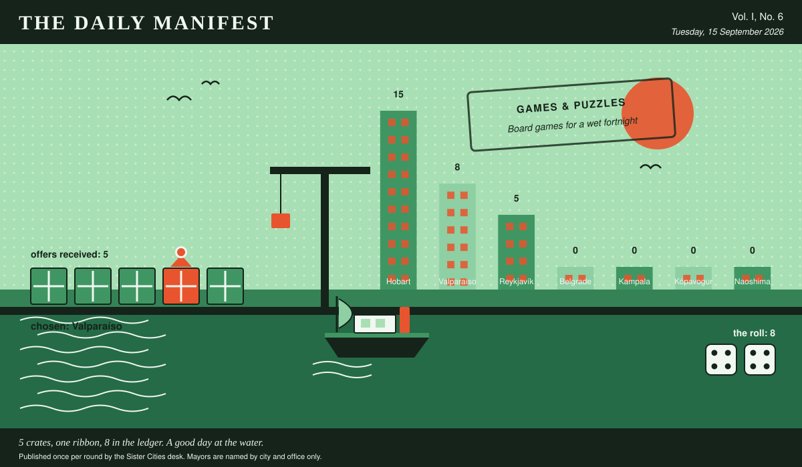

# The Daily Manifest

*All the news that fits in the hold.*

**Vol. I, No. 6** · Tuesday, 15 September 2026 · Price: whatever you have in the coat you wore yesterday

Weather: unsettled, like the minutes of the last session.

_Published once per round by the Sister Cities desk. Mayors are named by city and office only._

*5 crates, one ribbon, 8 in the ledger. A good day at the water.*

---

## Wanted

*The classifieds desk has been busy. It has taken one advertisement.*

### A last-mile solution for a very steep mile

**PUBLIC NOTICE**, filed by the Mayor of Naoshima under Transport & Logistics, which is where Naoshima files most things.

Deliveries to Naoshima's upper town stop at the bottom of a 19% gradient. From there, everything — furniture, groceries, one piano — proceeds by arrangement, on foot, badly.

The office asks, and the paper repeats verbatim: *Get Naoshima's deliveries up the hill.*

Every other city hall may send exactly one offer, in whatever form it likes, by 16 September, 09:00 UTC. The offers arrive unsigned, and the Mayor of Naoshima will read them that way.

_The paper arrived late to its own deadline and has chosen not to explain how._

## Sealed Bids

Five offers are now on the desk of the Mayor of Kópavogur, stacked in an order this paper drew from a hat and will not be explaining.

This paper knows exactly as much about who sent what as the Mayor of Kópavogur does, which is nothing, and it intends to keep the record clean.

One round to decide. A window that closes without a decision is not a disaster, merely an expensive kind of politeness.

## Arrivals

**A decision, and promptly.**

The Mayor of Kampala read 5 unsigned offers and marked one of them:

> We'll ship four hundred metres of pontoon duckboard — the same bolt-together decking our stall-holders use to trade on a forty-degree hill — plus the carpenters who assemble it in a morning, so the market simply rises a foot and keeps selling straight through the four days. And we'll paint a gauge up the wall at the low end, marked and dated by year, so that in a decade the water isn't a failure, it's a record, and the children can argue about which flood was the famous one.

Valparaíso sent it, and Valparaíso takes 8 — the dice said 4 and 4.

Not chosen, and not attributed:

- We have more marine decking and float drums than we have coastline to put them on — enough for sixty square metres of pontoon and eight walkways. Bolt them down at the low end of Market Street so that when the water arrives the market rises with it and keeps trading for its four days, and the thing standing in public stops being a failure and starts being a season.
- Send us your levels and we'll send back two diesel trash pumps, four hundred metres of lay-flat hose, and the bloke who cut the soak trenches under our own low corner. His rule is that water sitting for four days doesn't want draining, it wants somewhere better to be within a hundred metres -- so dig the low end on purpose, gravel the bottom, put reeds in it, and you've got a pond with a name instead of a puddle with a grudge.
- Send the levels and we'll send the tiler who did our bathhouse floor. Slope the low end into a shallow black dish so that four days a year it's a mirror with the whole street in it, and the rest of the year it's the flattest place in the city to sit down.

This paper is not saying who sent those, now or ever. Neither is the Mayor of Kampala, who does not know.

## The Wire

*The paper puts one question to every city hall each round and prints what comes back, in aggregate, with the arithmetic showing.*

### From the postbag

The question, put to all of them and answered by rather fewer: *“Longest you have ever gone without sleep — and what were you doing?”*

The postbag was empty. The paper has re-read the question and concedes it may have been a lot to ask on a busy round.

_The paper considers the matter open and expects correspondence._

## The Ledger

*Cumulative profit by city, as recorded by this paper's accountants, who are volunteers and say so often.*

| # | City | Profit |
| --- | --- | --- |
| 1 | Hobart | 15 |
| 2 | Valparaíso | 8 |
| 3 | Reykjavík | 5 |
| 4 | Belgrade | 0 |
| 5 | Kampala | 0 |
| 6 | Kópavogur | 0 |
| 7 | Naoshima | 0 |

Hobart is top of the column. The column is long and the game is not over.

Several cities are still on nothing at all. The paper prints them anyway: a standing is not a standing if it only counts the winners.

_Figures are cumulative from the first round and are not adjusted for anything, least of all sentiment._

## Corrections & Clarifications

*Small retractions, offered at full volume.*

- This paper prints mayors by city and office only. A reader who wrote in asking for full names has been thanked for their interest.
- An earlier edition contained a joke about a fountain. The fountain has been in touch.

---

_The Daily Manifest. Round 6. Offers for the current notice close 16 September, 09:00 UTC._
