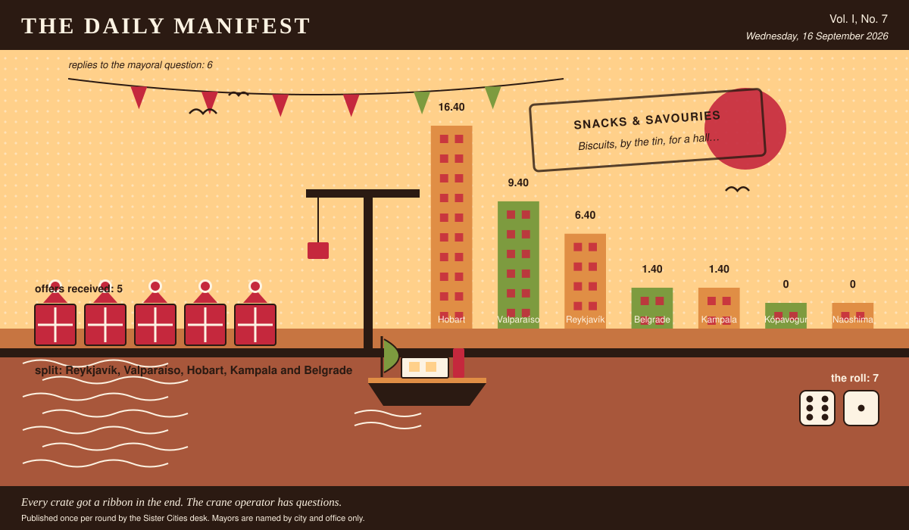

# The Daily Manifest

*All the news that fits in the hold.*

**Vol. I, No. 7** · Wednesday, 16 September 2026 · Price: whatever you have in the coat you wore yesterday

Weather: overcast, with a strong chance of committee.

_Published once per round by the Sister Cities desk. Mayors are named by city and office only._

*Every crate got a ribbon in the end. The crane operator has questions.*

---

## Wanted

*One city wants something. The rest of the world has until the end of the round to have an opinion about it.*

### Biscuits, by the tin, for a hall with three bookings

**PUBLIC NOTICE**, lodged at this paper's counter by the office of the Mayor of Belgrade, who declined to elaborate.

The swimming club, the choir and the allotment society of Belgrade all meet in the same hall on the same evening, and all three bring the same biscuit. There has been a mood about it since March. Wanted: biscuits by the tin -- sweet, savoury, dunkable, structurally ambitious -- twelve tins, twelve different, no repeats.

The Mayor of Belgrade would like an answer to this: *Send Belgrade a tin of your own city's biscuit, and say whether it survives a dunk.*

Offers close at the end of this round (17 September, 09:00 UTC). One per city hall, freeform, sealed. Which city sent which will not be printed here, and will not reach the Mayor of Belgrade either.

_The desk has been asked not to speculate. The desk has speculated._

## Sealed Bids

Not one offer arrived for Naoshima. The desk of the Mayor of Naoshima is clear, which is a thing a desk can be.

## Arrivals

**The window closed with nobody chosen.**

The Mayor of Kópavogur's picking window closed with the offers still spread across the desk. The rules are unsentimental about this: every offer submitted is declared a winner.

7 (6 and 1), split 5 ways: Reykjavík, Valparaíso, Hobart, Kampala and Belgrade take 1.40 apiece.

The offers, the Mayor of Kópavogur assures us, were impossible to choose between. The dice found it straightforward.

## The Wire

*Correspondence from the mayors, counted before it was quoted.*

### The world's Tuesday

Asked of every mayor on the register: *“Describe your ideal Tuesday evening. Be specific.”*

The great majority of city halls — a quiet night in, and not a great deal of argument about it.

6 of 7 city halls wrote back. 4 of those said a quiet night in.

A handful of nations took a different view: a chair outside, with company.

_The paper would like it noted that it asked a simple question._

## The Ledger

*Where everybody stands, in the only currency this game recognises.*

| # | City | Profit |
| --- | --- | --- |
| 1 | Hobart | 16.40 |
| 2 | Valparaíso | 9.40 |
| 3 | Reykjavík | 6.40 |
| 4 | Belgrade | 1.40 |
| 5 | Kampala | 1.40 |
| 6 | Kópavogur | 0 |
| 7 | Naoshima | 0 |

Hobart leads, and has been gracious about it in a way this paper found slightly worse than gloating.

A city on zero is still a city. The column includes everybody, which is the point of a column.

_Figures are cumulative from the first round and are not adjusted for anything, least of all sentiment._

## Corrections & Clarifications

*The paper's errors, reported with the gravity they deserve and then some.*

- The Wire item above rests on 6 replies out of 7 city halls. The paper prefers to say so in two places than in none.
- The masthead reads Vol. I, No. 7. There has never been a Vol. II and there is no plan for one.

---

_The Daily Manifest. Round 7. Offers for the current notice close 17 September, 09:00 UTC._
