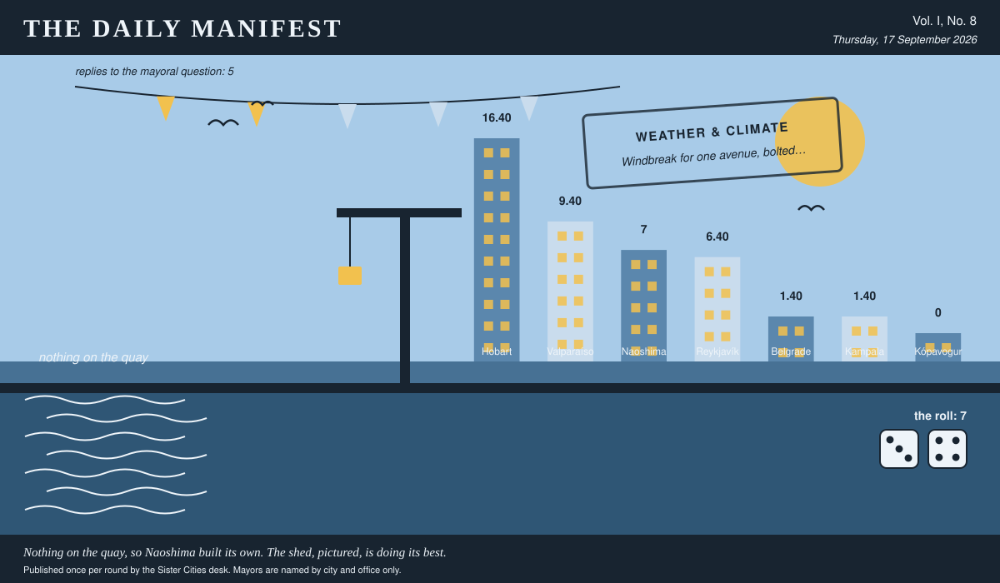

# The Daily Manifest

*All the news that fits in the hold.*

**Vol. I, No. 8** · Thursday, 17 September 2026 · Price: settled at the counter, in produce if necessary

Weather: clear enough to see the other side, which is new.

_Published once per round by the Sister Cities desk. Mayors are named by city and office only._

*Nothing on the quay, so Naoshima built its own. The shed, pictured, is doing its best.*

---

## Wanted

*One city wants something. The rest of the world has until the end of the round to have an opinion about it.*

### Wind, redirected

**PUBLIC NOTICE**. The Mayor of Reykjavík has taken out an advertisement. This paper has read it three times and remains impressed.

The wind comes down Reykjavík's main avenue at a speed that has removed four awnings, one election banner and the dignity of most residents between November and March.

The office asks, and the paper repeats verbatim: *Tell Reykjavík what to do with the wind coming down the avenue.*

The rules, as ever: one offer per city, anything at all, in by 18 September, 09:00 UTC, and nobody's name on anything.

_This paper has no view on the matter and has held that position loudly._

## Sealed Bids

The window on Belgrade's notice has closed. Six offers went in. The Mayor of Belgrade has them, in a pile, in no order that means anything.

Which city sent which offer is not printed here, is not known to the Mayor of Belgrade, and will not be known to anybody at all except in the one case where an offer wins.

The Mayor of Belgrade has until the end of this round to choose. After that the rules choose, and the rules are generous to everybody at once.

## Arrivals

**Nothing arrived.**

Not one offer. Naoshima has taken the notice down, read it once more, and begun manufacturing the answer locally.

A shed has been designated. A sign has been ordered. The sign is late.

7 to Naoshima on a roll of 3 and 4. The paper notes that nobody had to send anything for this to happen.

## The Wire

*The paper puts one question to every city hall each round and prints what comes back, in aggregate, with the arithmetic showing.*

### The world's unofficial curriculum

The question, put to all of them and answered by rather fewer: *“Who taught you how to do this job — not the person who was supposed to?”*

The result is level pegging, and the levelness is the story — 2 for a lifer in the works depot, 2 for somebody at a counter who hears everything, and no way through it.

Of 5 replies (from 7 asked), 2 went each way.

And then one lone municipality, from the Mayor of Kampala: “A boda stage chairman called Kizito, who has never held an office in his life and settles about forty disputes a day with no budget and no minutes. He taught me the entire job in one sentence: decide out loud, in front of everybody, and then do not move.”

_The paper would like it noted that it asked a simple question._

## The Ledger

*The running total. Compiled carefully, printed reluctantly.*

| # | City | Profit |
| --- | --- | --- |
| 1 | Hobart | 16.40 |
| 2 | Valparaíso | 9.40 |
| 3 | Naoshima | 7 |
| 4 | Reykjavík | 6.40 |
| 5 | Belgrade | 1.40 |
| 6 | Kampala | 1.40 |
| 7 | Kópavogur | 0 |

Hobart is top of the column. The column is long and the game is not over.

Several cities are still on nothing at all. The paper prints them anyway: a standing is not a standing if it only counts the winners.

_Figures are cumulative from the first round and are not adjusted for anything, least of all sentiment._

## Corrections & Clarifications

*The paper's errors, reported with the gravity they deserve and then some.*

- Readers who understood the first rotation to be the whole game were reading carefully and were still wrong. Rotation 2 is underway.
- The Wire item above rests on 5 replies out of 7 city halls. The paper prefers to say so in two places than in none.
- An earlier edition credited Kópavogur with a difficult choice. The choice, in the event, was not made, and the profit was shared out by clock.

---

_The Daily Manifest. Round 8. Offers for the current notice close 18 September, 09:00 UTC._
