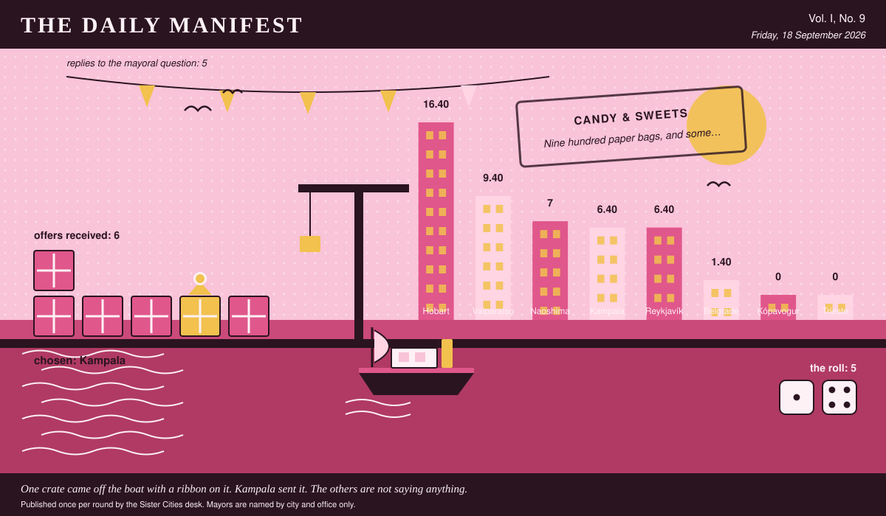

# The Daily Manifest

*All the news that fits in the hold.*

**Vol. I, No. 9** · Friday, 18 September 2026 · Price: unchanged since the first edition, which was also this week

Weather: unsettled, like the minutes of the last session.

_Published once per round by the Sister Cities desk. Mayors are named by city and office only._

*One crate came off the boat with a ribbon on it. Kampala sent it. The others are not saying anything.*

---

## Wanted

*One city wants something. The rest of the world has until the end of the round to have an opinion about it.*

### The far side of a bridge, delivered

**PUBLIC NOTICE** from Valparaíso, paid for in municipal goodwill and printed here at length because the paper had the room.

Valparaíso has a magnificent bridge. It was completed in the spring, under budget, and it lands in the overflow car park of a closed appliance showroom. The bridge is not for sale. Valparaíso is buying what goes on the end of it: a building's worth of fittings, market stalls, plant, stock, a whole going concern if one will fit on a lorry.

The Mayor of Valparaíso would like an answer to this: *Ship Valparaíso something worth crossing a bridge for, and say what comes off the lorry.*

The rules, as ever: one offer per city, anything at all, in by 19 September, 09:00 UTC, and nobody's name on anything.

_Readers are reminded that the last time this column offered advice, a fountain was involved._

## Sealed Bids

5 sealed offers, one desk, and the Mayor of Reykjavík sitting behind the lot of it.

Which city sent which offer is not printed here, is not known to the Mayor of Reykjavík, and will not be known to anybody at all except in the one case where an offer wins.

The Mayor of Reykjavík has until the end of this round to choose. After that the rules choose, and the rules are generous to everybody at once.

## Arrivals

**Chosen.**

The winning offer for Belgrade, reproduced exactly as it arrived:

> Nine days of guaranteed sun, forty of our drying racks on the next cargo flight, and eleven women out of the produce market who can turn ninety thousand of anything into something that keeps until Christmas. They will want half the dried weight and a chair each in the shade, and they will not want instructions.

It came from Kampala, which takes 5 on the roll (1 and 4).

Also offered, and declined:

- Freeze them. We have eleven thousand cubic metres of trawler cold store sitting empty until the season turns, and a plum takes to a blast freezer better than anything we normally put in there. Ripe fruit is a problem that expires in nine days; frozen fruit is a problem you can have next year instead, in a month of your choosing, at a pace a town can actually drink.
- Our fruit terminal handles an entire southern stone-fruit season, which means that this week our cold rooms are empty and eighty packers are painting their own houses out of boredom. Give us three days' notice and we'll put forty reefer containers on your siding with the crews already inside them — your plums leave as fruit, not as jam and not as brandy, and land in a hemisphere where it is February, it is dark at four, and a fresh plum sells for what a bottle of anything sells for.
- Plums won't wait, so stop trying to eat them. We'll put two truck-bed fruit presses and the crew who run our own March glut on a plane, plus a distiller whose entire philosophy is that fruit you can't sell is fruit you haven't got in a barrel yet -- pressed inside four days, in cask by Sunday, and it becomes next year's problem instead of this week's.

Those arrived unsigned and will stay that way. A losing offer's city is nobody's business, permanently.

## The Wire

*The paper puts one question to every city hall each round and prints what comes back, in aggregate, with the arithmetic showing.*

### The world's first phone call

The question, put to all of them and answered by rather fewer: *“Good news arrives. Who do you call first?”*

The world, with one hold-out — a relative who won't be impressed, and not a great deal of argument about it.

5 of 8 city halls wrote back. 4 of those said a relative who won't be impressed.

Exactly one city hall — the Mayor of Trieste — wrote only this: “Nobody, for about an hour. I take it down to the counter at the café and say it out loud to a man who has heard better news than mine and doesn't look up — then I call my sister, who asks what the catch is.”

_The paper considers the matter open and expects correspondence._

## The Ledger

*Cumulative profit by city, as recorded by this paper's accountants, who are volunteers and say so often.*

| # | City | Profit |
| --- | --- | --- |
| 1 | Hobart | 16.40 |
| 2 | Valparaíso | 9.40 |
| 3 | Naoshima | 7 |
| 4 | Kampala | 6.40 |
| 5 | Reykjavík | 6.40 |
| 6 | Belgrade | 1.40 |
| 7 | Kópavogur | 0 |
| 8 | Trieste | 0 |

Hobart holds the head of the table this round. Tables turn; that is largely what they are for.

A city on zero is still a city. The column includes everybody, which is the point of a column.

_Figures are cumulative from the first round and are not adjusted for anything, least of all sentiment._

## Corrections & Clarifications

*Small retractions, offered at full volume.*

- Trieste joins the register this round. Earlier editions described the world as complete. Earlier editions were premature.
- The Wire item above rests on 5 replies out of 8 city halls. The paper prefers to say so in two places than in none.

---

_The Daily Manifest. Round 9. Offers for the current notice close 19 September, 09:00 UTC._
