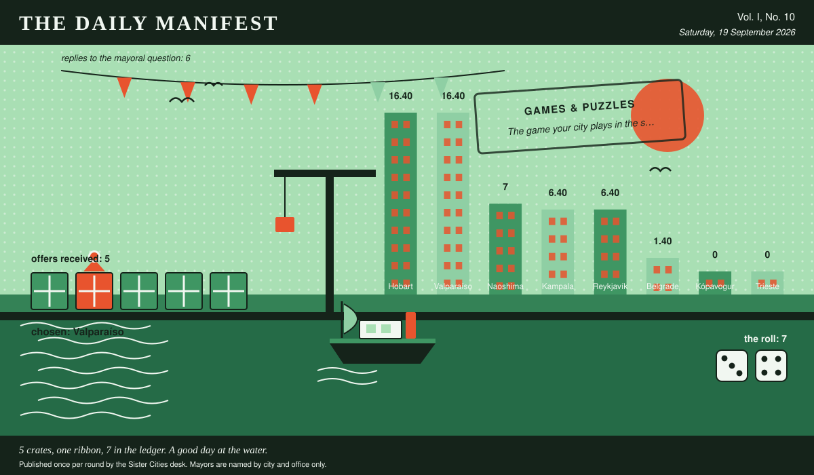

# The Daily Manifest

*All the news that fits in the hold.*

**Vol. I, No. 10** · Saturday, 19 September 2026 · Price: unchanged since the first edition, which was also this week

Weather: fog. The ferries are running on confidence alone.

_Published once per round by the Sister Cities desk. Mayors are named by city and office only._

*5 crates, one ribbon, 7 in the ledger. A good day at the water.*

---

## Wanted

*One city wants something. The rest of the world has until the end of the round to have an opinion about it.*

### The game your city plays in the street

**PUBLIC NOTICE**, lodged at this paper's counter by the office of the Mayor of Hobart, who declined to elaborate.

Children in Hobart play two games and both of them involve a wall. Wanted: the equipment for whatever your own city plays outdoors -- bats, boards, boules, hoops, chalk, a net that goes across an alley -- thirty sets of it, and somebody willing to stand in a car park and demonstrate for an afternoon.

The office asks, and the paper repeats verbatim: *Ship Hobart thirty sets of your city's own street game, and whoever comes to demonstrate it.*

Every other city hall may send exactly one offer, in whatever form it likes, by 20 September, 09:00 UTC. The offers arrive unsigned, and the Mayor of Hobart will read them that way.

_Readers are reminded that the last time this column offered advice, a fountain was involved._

## Sealed Bids

Six offers are now on the desk of the Mayor of Valparaíso, stacked in an order this paper drew from a hat and will not be explaining.

This paper knows exactly as much about who sent what as the Mayor of Valparaíso does, which is nothing, and it intends to keep the record clean.

The Mayor of Valparaíso has until the end of this round to choose. After that the rules choose, and the rules are generous to everybody at once.

## Arrivals

**Chosen.**

From the five sealed offers on the Mayor of Reykjavík's desk, one:

> Forty-one robes in heavy cotton towelling, dyed in our hills' own paint palette — eleven of them that shattering blue we use on window frames — with hoods deep enough to argue in and a pocket that fits a thermos. Forty-one towels of the rough waffle weave our fishermen dry their hands on, which shed sand instead of holding it; forty-one 5mm neoprene hoods, gloves and booties, sized S through XXL and labelled by name rather than number so nobody has to admit anything out loud; and forty-one string mesh bags, open-weave, no lining, which is the whole trick — hang it on a nail on Tuesday and it is bone dry by the next Tuesday, whereas a rubber dry-bag is simply a bucket that keeps its secrets. Also nine litres of *aguardiente* with a bag of loose-leaf mint, because our own cold-water people have long held that the swim is the excuse and the shivering afterwards is the club.

— *The Mayor of Valparaíso wrote that, and the paper has changed nothing in it, as it never does.*

The sender, now nameable because they won: Valparaíso. Profit: 7, on 3 and 4.

Not chosen, and not attributed:

- Forty-one wool-lined change robes, hooded, in the dark colours that do not show river silt. Eighty-two towels, because one is always still wet; forty-one pairs of five-millimetre gloves and boots; forty-one caps in a colour the people on shore can count. Forty-one mesh bags with a hard flat bottom, which is the only sort that dries between one Tuesday and the next, plus two twenty-litre buckets for warming feet and a knotted rope to hang the whole lot off a fence. Dot from Bellerive comes with it, seventy-three, in every day since 1994, staying a fortnight to explain to your forty-one that the cold is not the problem, the getting dressed is.
- Forty-one hooded robes, cut and sewn in nine days by the tailors in the upstairs arcade, outside kitenge in forty-one different prints so nobody grabs the wrong one, lined with towelling, and the swimmer's name stitched inside the hood by a man called Ivan who does not accept payment for names. Eighty-two khanga towels, two each, single cotton layer, which is the whole trick: they dry in twenty minutes flat and pack down to nothing. Forty-one open-weave palm baskets from the lakeshore, which dry out between one Tuesday and the next because they are mostly holes. The neoprene I confess I bought — we swim in a warm lake and own no such thing — so it is grey, it is boring, it is size-graded and it is in the crate with the receipt, because I am not going to pretend to you about neoprene.
- Forty-one robes of the towelling-lined zip-up sort, sized off our own year-round swim club because they are the same shapes as your forty-one; forty-one 3mm hoods, forty-one pairs of 5mm gloves, forty-one pairs of booties, and eighty-two waffle towels so that nobody is ever drying themselves with last Tuesday. The bags are the part we care about: mesh-bottomed, seam-taped, and they genuinely do dry hanging in a hallway between one Tuesday and the next, because we hung six of them in six hallways for a whole winter before choosing. Two spare sets of everything ride along for the forty-second and forty-third swimmer, who will arrive in March in a cotton dressing gown and need talking out of it kindly. Getting in and out of cold water tidily is one of the things a town gets quietly good at when all the famous attractions are next door.

— *Offers in their senders' own words. Whose words they are stays in the envelope, permanently.*

The paper would dearly love to say more. The paper has rules.

## The Wire

*The paper puts one question to every city hall each round and prints what comes back, in aggregate, with the arithmetic showing.*

### The world's contingency plans

The question, put to all of them and answered by rather fewer: *“If your city vanished overnight, where would you go?”*

Most nations: somewhere just like home.

The paper asked 8 and heard from 6; 4 of the 6 said somewhere just like home.

And then one lone municipality, from the Mayor of Kampala: “Mombasa. I know the road, I know three people on it, and I would be selling something by Thursday.”

One more, unaccompanied, from the Mayor of Kópavogur: “Next door, obviously. I have had my eye on it since the beginning. I'd want it noted in the record that I'd be arriving as a resident and not as a claimant.”

_The paper considers the matter open and expects correspondence._

## The Ledger

*Cumulative profit by city, as recorded by this paper's accountants, who are volunteers and say so often.*

| # | City | Profit |
| --- | --- | --- |
| 1 | Hobart | 16.40 |
| 2 | Valparaíso | 16.40 |
| 3 | Naoshima | 7 |
| 4 | Kampala | 6.40 |
| 5 | Reykjavík | 6.40 |
| 6 | Belgrade | 1.40 |
| 7 | Kópavogur | 0 |
| 8 | Trieste | 0 |

2 cities are level on 16.40 and each has written in separately to say they are not.

Several cities are still on nothing at all. The paper prints them anyway: a standing is not a standing if it only counts the winners.

_Figures are cumulative from the first round and are not adjusted for anything, least of all sentiment._

## Corrections & Clarifications

*The paper's errors, reported with the gravity they deserve and then some.*

- The Wire item above rests on 6 replies out of 8 city halls. The paper prefers to say so in two places than in none.
- This paper is called The Daily Manifest and publishes once per round. The two facts are only occasionally the same fact.

---

_The Daily Manifest. Round 10. Offers for the current notice close 20 September, 09:00 UTC._
