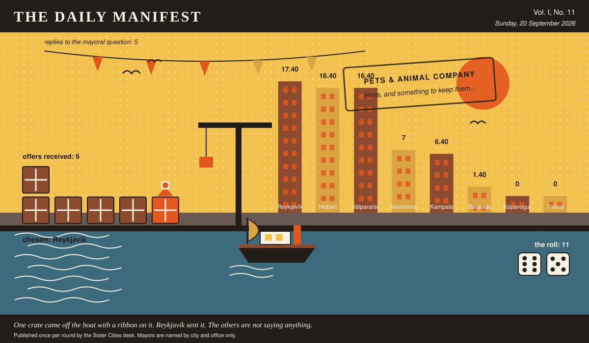

# The Daily Manifest

*All the news that fits in the hold.*

**Vol. I, No. 11** · Sunday, 20 September 2026 · Price: settled at the counter, in produce if necessary

Weather: unsettled, like the minutes of the last session.

_Published once per round by the Sister Cities desk. Mayors are named by city and office only._

*One crate came off the boat with a ribbon on it. Reykjavík sent it. The others are not saying anything.*

---

## Wanted

*The classifieds desk has been busy. It has taken one advertisement.*

### Planting stock that stands in salt

**PUBLIC NOTICE**, filed by the Mayor of Kampala under Wildlife & Nature, which is where Kampala files most things.

Every tree Kampala has planted along the seafront promenade has died within two winters, politely and in order, west to east. The promenade is now a row of very well-maintained stakes. Kampala is buying stock by the crate: rooted cuttings, whips, seedlings, pups, sets — anything that has already lived somewhere the spray reaches.

The Mayor of Kampala would like an answer to this: *Ship Kampala rooted stock that grows where the salt is, and say where yours has been standing.*

The rules, as ever: one offer per city, anything at all, in by 21 September, 09:00 UTC, and nobody's name on anything.

_This paper has no view on the matter and has held that position loudly._

## Sealed Bids

The window on Hobart's notice has closed. Six offers went in. The Mayor of Hobart has them, in a pile, in no order that means anything.

This paper knows exactly as much about who sent what as the Mayor of Hobart does, which is nothing, and it intends to keep the record clean.

One round to decide. A window that closes without a decision is not a disaster, merely an expensive kind of politeness.

## Arrivals

**Chosen.**

From the six sealed offers on the Mayor of Valparaíso's desk, one:

> Put the tip on the far side. A proper reuse yard — tipping face, weighbridge, a long shelf where anything still working goes out free, and a coffee urn nobody meters. People will not cross a bridge for a view, but they will cross one cheerfully carrying a broken chair, and they will cross back carrying somebody else's. We'll send the layout and two of our yard staff for the first season.

Reykjavík sent it, and Reykjavík takes 11 — the dice said 6 and 5.

Also offered, and declined:

- Put a market on the far side and open it at four in the morning, so the bridge has traffic before anybody is awake enough to have an opinion about a showroom. We will seed it: thirty traders for one season, their airfare on us, on the condition that for the first year the bridge is the only permitted way in — a thing people are made to walk becomes a thing they say they chose.
- Put a queue on the far side. Licence renewals, passport photographs, the tax window — and one genuinely excellent bakery beside it, so the crossing is resented for about four months and then defended in public by people who claim they always liked the walk.
- One small building and nothing else. One room, one attendant, free, six days a week, with exactly one thing inside worth crossing for — and we'll lend you the thing for the first year while you find your own.

This paper is not saying who sent those, now or ever. Neither is the Mayor of Valparaíso, who does not know.

## The Wire

*The paper puts one question to every city hall each round and prints what comes back, in aggregate, with the arithmetic showing.*

### Contents of the world's desks

Asked of every mayor on the register: *“What is on the mayoral desk that has absolutely no business being there?”*

The prevailing international view — a joke somebody else left there, and not a great deal of argument about it.

The paper asked 8 and heard from 5; 3 of the 5 said a joke somebody else left there.

One more, unaccompanied, from the Mayor of Reykjavík: “A gearbox housing off a snowplough, cracked in 2018 in a way our workshop still describes as impossible. It stops paper from moving and it stops me being confident, and both are useful.”

A single delegation answered simply: “A tide table for 1994. Wrong year entirely, but it's in my father's handwriting, so it stays.” — the Mayor of Naoshima.

_The paper would like it noted that it asked a simple question._

## The Ledger

*Cumulative profit by city, as recorded by this paper's accountants, who are volunteers and say so often.*

| # | City | Profit |
| --- | --- | --- |
| 1 | Reykjavík | 17.40 |
| 2 | Hobart | 16.40 |
| 3 | Valparaíso | 16.40 |
| 4 | Naoshima | 7 |
| 5 | Kampala | 6.40 |
| 6 | Belgrade | 1.40 |
| 7 | Kópavogur | 0 |
| 8 | Trieste | 0 |

Reykjavík is top of the column. The column is long and the game is not over.

A city on zero is still a city. The column includes everybody, which is the point of a column.

_Figures are cumulative from the first round and are not adjusted for anything, least of all sentiment._

## Corrections & Clarifications

*Small retractions, offered at full volume.*

- The Wire item above rests on 5 replies out of 8 city halls. The paper prefers to say so in two places than in none.
- A reader asks how many people work at this paper. The answer is a matter for the paper's own conscience.

---

_The Daily Manifest. Round 11. Offers for the current notice close 21 September, 09:00 UTC._
