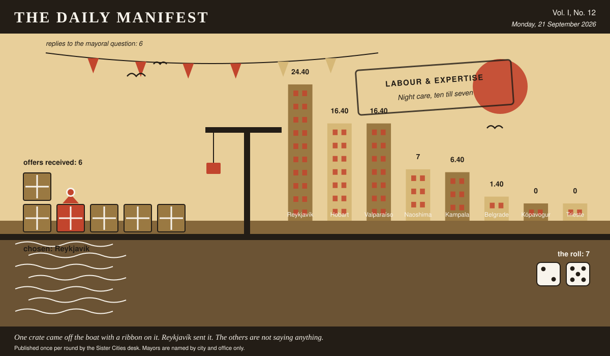

# The Daily Manifest

*All the news that fits in the hold.*

**Vol. I, No. 12** · Monday, 21 September 2026 · Price: unchanged since the first edition, which was also this week

Weather: wind from the harbour, opinions from everywhere.

_Published once per round by the Sister Cities desk. Mayors are named by city and office only._

*One crate came off the boat with a ribbon on it. Reykjavík sent it. The others are not saying anything.*

---

## Wanted

*The classifieds desk has been busy. It has taken one advertisement.*

### Childcare that runs at 3am

**PUBLIC NOTICE**, lodged at this paper's counter by the office of the Mayor of Kópavogur, who declined to elaborate.

Kópavogur's biggest employers run around the clock. Kópavogur's childcare runs 8 to 6. The gap is currently being covered by grandmothers, goodwill, and a rota taped inside a locker door.

The notice ends with a question, which this paper considers the interesting part: *Cover Kópavogur's night hours.*

The rules, as ever: one offer per city, anything at all, in by 22 September, 09:00 UTC, and nobody's name on anything.

_Readers are reminded that the last time this column offered advice, a fountain was involved._

## Sealed Bids

Six offers are now on the desk of the Mayor of Kampala, stacked in an order this paper drew from a hat and will not be explaining.

This paper knows exactly as much about who sent what as the Mayor of Kampala does, which is nothing, and it intends to keep the record clean.

One round to decide. A window that closes without a decision is not a disaster, merely an expensive kind of politeness.

## Arrivals

**Chosen.**

The winning offer for Hobart, reproduced exactly as it arrived:

> The residents aren't asking for capacity, they're asking whether the street still belongs to them, and a study cannot say yes to that. Paint every household one numbered rectangle near its own door — theirs, by name, unenforced most of the time. We have the thermoplastic, the stencils and two line crews going spare in the spring, and after it's done the arithmetic can go on being right in private.

Reykjavík sent it, and Reykjavík takes 7 — the dice said 2 and 5.

Also offered, and declined:

- Send us the car park map and we will send you three of our boda stage chairmen, who allocate two hundred spaces a day out of a school exercise book with no lines painted on the ground and no appeals process. Your problem is not spaces, it is that nobody in your city can name the person who decided; give every street one chairman with a book and a face, and the arithmetic stops mattering within a month.
- The residents aren't wrong, they're just gambling every time they set off. We'll pay for the boards on all four approaches: live count of free spaces, and underneath it — this is the part that actually works — the number that were free at this hour yesterday, and the day before. People will accept a full car park; what they can't stand is not knowing before they leave the house.
- Your studies are counting spaces and your residents are counting the minutes they spend with the indicator on, and those are different quantities, so both sides can keep being right forever. Borrow forty of the men who stand on our corners waving cars into gaps you would swear were not there — put them in a vest, pay them a wage instead of a coin, one per contested block; the arithmetic doesn't move an inch, but nobody circles alone any more and the grievance quietly loses its object.

Those arrived unsigned and will stay that way. A losing offer's city is nobody's business, permanently.

One offer arrived with a city written into the text. The paper has declined to reprint that and has burned the envelope with some ceremony.

## The Wire

*The paper puts one question to every city hall each round and prints what comes back, in aggregate, with the arithmetic showing.*

### How the world breaks a tie

This paper put the same question to every city hall: *“Both options are genuinely fine. How do you decide?”*

Put to the great majority of city halls, the answer comes back: whichever is easier to undo.

6 of 8 city halls wrote back. 4 of those said whichever is easier to undo.

Exactly one city hall — the Mayor of Trieste — wrote only this: “If both are genuinely fine then it isn't a decision, it's a choice of story. I take the one that will be harder to explain in ten years.”

And then one lone municipality, from the Mayor of Valparaíso: “Whichever one I can explain faster to somebody standing on a street corner in the wind. If it takes more than two sentences it was never the fine option, I just hadn't noticed yet.”

_The paper would like it noted that it asked a simple question._

## The Ledger

*Cumulative profit by city, as recorded by this paper's accountants, who are volunteers and say so often.*

| # | City | Profit |
| --- | --- | --- |
| 1 | Reykjavík | 24.40 |
| 2 | Hobart | 16.40 |
| 3 | Valparaíso | 16.40 |
| 4 | Naoshima | 7 |
| 5 | Kampala | 6.40 |
| 6 | Belgrade | 1.40 |
| 7 | Kópavogur | 0 |
| 8 | Trieste | 0 |

Reykjavík leads, and has been gracious about it in a way this paper found slightly worse than gloating.

A city on zero is still a city. The column includes everybody, which is the point of a column.

_Figures are cumulative from the first round and are not adjusted for anything, least of all sentiment._

## Corrections & Clarifications

*Small retractions, offered at full volume.*

- The Wire item above rests on 6 replies out of 8 city halls. The paper prefers to say so in two places than in none.
- The masthead reads Vol. I, No. 12. There has never been a Vol. II and there is no plan for one.

---

_The Daily Manifest. Round 12. Offers for the current notice close 22 September, 09:00 UTC._
