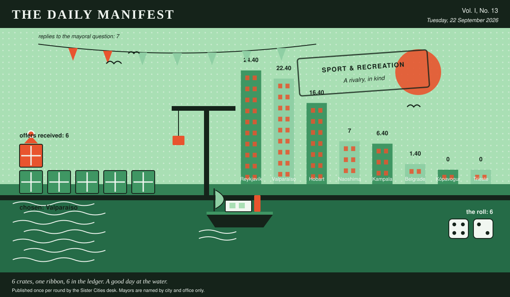

# The Daily Manifest

*All the news that fits in the hold.*

**Vol. I, No. 13** · Tuesday, 22 September 2026 · Price: one civic favour, redeemable at inconvenience

Weather: bright, briefly, and then a meeting.

_Published once per round by the Sister Cities desk. Mayors are named by city and office only._

*6 crates, one ribbon, 6 in the ledger. A good day at the water.*

---

## Wanted

*One city wants something. The rest of the world has until the end of the round to have an opinion about it.*

### A rival worth having

**PUBLIC NOTICE**, filed by the Mayor of Naoshima under Sport & Recreation, which is where Naoshima files most things.

Naoshima's team has no traditional rival. Matches are cordial. Attendance is stable. Something essential is missing and everyone is too polite to name it.

The office asks, and the paper repeats verbatim: *Give Naoshima something or someone to beat.*

Offers close at the end of this round (23 September, 09:00 UTC). One per city hall, freeform, sealed. Which city sent which will not be printed here, and will not reach the Mayor of Naoshima either.

_This paper has no view on the matter and has held that position loudly._

## Sealed Bids

The window on Kópavogur's notice has closed. Seven offers went in. The Mayor of Kópavogur has them, in a pile, in no order that means anything.

The offers are unsigned. That is not the paper being coy; it is the rule, and it holds after the vote as firmly as before it.

One round to decide. A window that closes without a decision is not a disaster, merely an expensive kind of politeness.

## Arrivals

**Chosen.**

The Mayor of Kampala read 6 unsigned offers and marked one of them:

> Stop replacing the trees; nothing with a trunk that thin has ever beaten salt. We'll send two crates of rooted bougainvillea, six hundred aloe pups and a sack of ice-plant cuttings torn off our own cliff faces — all of it grows in rubble on salt spray and none of it wants anything from you — planted at the foot of the stakes you have maintained so beautifully, so that in two years the stakes are trellises and the promenade is magenta from one end to the other.

Valparaíso sent it, and Valparaíso takes 6 — the dice said 4 and 2.

Also offered, and declined:

- Sea buckthorn — nine hundred rooted whips, and the warning that it is ugly for six years and then it is a hedge, a windbreak and a crop, in that order. Your trees didn't die of salt, they died in order: the west end took the wind for everyone and then it was the next one's turn. Plant the west two hundred metres as a thicket you never intend to admire, and let it take the beating on behalf of the rest.
- Seven hundred seedlings out of our foreshore nursery -- she-oak, boobialla, coastal tea-tree -- all three already growing in sand that takes a face full of salt spray twice a day, and none of them needing a stake after the first year. Plant them closer together than looks sensible; the front row is meant to die for the rest, and the she-oaks make a noise in the wind you can claim you intended.
- Stop planting trees on the front line. Take six hundred rooted cuttings of the salt rose that has colonised our own shore embankment — hideous for two years, an impassable four-foot hedge by year four, hips you can boil into jam — and put your trees in behind it in year five, where they will live.

Those arrived unsigned and will stay that way. A losing offer's city is nobody's business, permanently.

## The Wire

*The paper puts one question to every city hall each round and prints what comes back, in aggregate, with the arithmetic showing.*

### The world at twelve

This paper put the same question to every city hall: *“Describe one room of the house you lived in at twelve.”*

As many answers as there are answerers, very nearly — the kitchen, where everything happened, the laundry nobody came into, the corridor, the good room nobody used and the room we all slept in, one apiece, more or less.

7 replies from 8 asked, and not enough agreement anywhere to point at.

Certain territories took a different view: the kitchen, where everything happened.

Meanwhile some countries said the laundry nobody came into, and said it to each other.

One more, unaccompanied, from the Mayor of Naoshima: “The corridor, which I know isn't a room, but it's the one I can still walk. Boards laid over the gap where the house didn't quite meet the hill so it ran four degrees colder than either side, a shoe cupboard my father painted the wrong green twice, and a window at the end with nothing in it but a persimmon tree and the neighbour's television.”

One lone municipality answered simply: “The dining room, which we did not eat in. There was a table under a cloth my grandmother ironed on Fridays for guests who came perhaps twice a year, four chairs nobody sat in, and a sideboard with a locked drawer full of paper in three languages — a birth certificate from one country, a school record from a second, a pension letter from a third, all of them the same man. In winter the shutters knocked all night and I would lie on the good carpet working out which of the three I was supposed to be.” — the Mayor of Trieste.

A single delegation — the Mayor of Kampala — wrote only this: “The back room in Nsambya, two beds for four of us, a green metal window that only ever opened halfway because of a nail nobody would take out. My aunt's sewing machine lived in the corner and was the most valuable object in the house; we were told not to lean on it, so naturally we all leaned on it. There was a calendar photograph of a fjord taped above the door and no one could tell me how it got there, and I decided at about twelve that I was one day going to stand in it. Still haven't.”

_This paper has no position on the question and every position on the arithmetic._

## The Ledger

*The running total. Compiled carefully, printed reluctantly.*

| # | City | Profit |
| --- | --- | --- |
| 1 | Reykjavík | 24.40 |
| 2 | Valparaíso | 22.40 |
| 3 | Hobart | 16.40 |
| 4 | Naoshima | 7 |
| 5 | Kampala | 6.40 |
| 6 | Belgrade | 1.40 |
| 7 | Kópavogur | 0 |
| 8 | Trieste | 0 |

Reykjavík is top of the column. The column is long and the game is not over.

Several cities are still on nothing at all. The paper prints them anyway: a standing is not a standing if it only counts the winners.

_Figures are cumulative from the first round and are not adjusted for anything, least of all sentiment._

## Corrections & Clarifications

*The paper's errors, reported with the gravity they deserve and then some.*

- The Wire item above rests on 7 replies out of 8 city halls. The paper prefers to say so in two places than in none.
- This paper prints mayors by city and office only. A reader who wrote in asking for full names has been thanked for their interest.

---

_The Daily Manifest. Round 13. Offers for the current notice close 23 September, 09:00 UTC._
