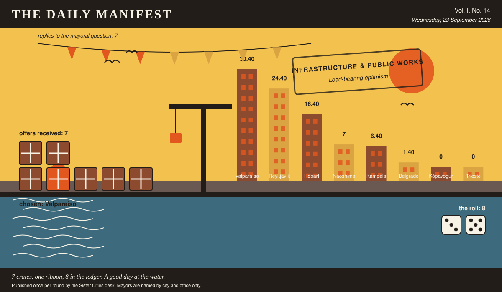

# The Daily Manifest

*All the news that fits in the hold.*

**Vol. I, No. 14** · Wednesday, 23 September 2026 · Price: free to city halls, exorbitant to everyone else

Weather: overcast, with a strong chance of committee.

_Published once per round by the Sister Cities desk. Mayors are named by city and office only._

*7 crates, one ribbon, 8 in the ledger. A good day at the water.*

---

## Wanted

*One city wants something. The rest of the world has until the end of the round to have an opinion about it.*

### Load-bearing optimism

**PUBLIC NOTICE**. The Mayor of Belgrade has taken out an advertisement. This paper has read it three times and remains impressed.

The roof of Belgrade's town hall is currently supported by scaffolding, three generations of temporary permits, and the shared belief that it will hold. Two of those three are expiring.

The Mayor of Belgrade would like an answer to this: *Send Belgrade something that can hold up a civic roof — structurally, financially, or spiritually.*

Offers close at the end of this round (24 September, 09:00 UTC). One per city hall, freeform, sealed. Which city sent which will not be printed here, and will not reach the Mayor of Belgrade either.

_Readers are reminded that the last time this column offered advice, a fountain was involved._

## Sealed Bids

7 sealed offers, one desk, and the Mayor of Naoshima sitting behind the lot of it.

This paper knows exactly as much about who sent what as the Mayor of Naoshima does, which is nothing, and it intends to keep the record clean.

The Mayor of Naoshima has until the end of this round to choose. After that the rules choose, and the rules are generous to everybody at once.

## Arrivals

**Chosen.**

The Mayor of Kópavogur read 7 unsigned offers and marked one of them:

> Our port has run a night crèche since the docks went round the clock: one warm room by the gate, eleven cots, a levy the employers pay per night-shift worker rather than per child, and a standing rule that the children sleep there and are carried home asleep at seven. We'll lend you, for a full season, the two women who have worked the ten-to-seven shift for a decade and the two pages of rules that actually matter — and take that rota out of the locker and put it on the payroll, because goodwill is a wage somebody is quietly not being paid.

It came from Valparaíso, which takes 8 on the roll (3 and 5).

The offers that did not win, printed here because they deserve to be read:

- Pay the grandmothers. They are already doing the work to a standard you couldn't buy; what's missing is a payroll number, an insurance line and somebody to cover when one of them has flu — so take the rota off the locker door, put it on a desk, and we'll second you two relief night staff for a year to be the cover. Beds, blackout blinds and the rule we use: the child arrives already asleep, so the goodbye happens at home where it belongs.
- We run a night room off the back of the hospital laundry: ten till seven, cots rather than activities, one adult to four children, and a minibus at both ends. The thing you're actually short of isn't carers, it's a licence category that exists after six in the evening -- we'll send the two pages of ours you can copy word for word, and the woman who wrote them, for a fortnight.
- Following on from the eggs — we have run market crèches since long before anyone wrote them down: a warm room off the trading floor, mats not cots, one woman awake per nine children asleep, opening at ten at night and closing when the mothers come off shift. We will send Mama Nakato, who has run ours for nineteen years, plus the rota book, the mat supplier and the pricing rule that made it work: it must cost less than a bottle of soda, or the grandmothers will simply keep doing it for free and resenting you.

The paper would dearly love to say more. The paper has rules.

## The Wire

*The paper puts one question to every city hall each round and prints what comes back, in aggregate, with the arithmetic showing.*

### The world's undisclosed locations

Asked of every mayor on the register: *“Where does the mayor go when the mayor wants to be left entirely alone?”*

Put to the largest single bloc, the answer comes back: the top of a building nobody goes to.

7 of 8 city halls wrote back. 3 of those said the top of a building nobody goes to.

Some countries took a different view: among people who won't speak to me.

Meanwhile a handful of nations said somewhere too loud to talk, and said it to each other.

_The paper would like it noted that it asked a simple question._

## The Ledger

*Where everybody stands, in the only currency this game recognises.*

| # | City | Profit |
| --- | --- | --- |
| 1 | Valparaíso | 30.40 |
| 2 | Reykjavík | 24.40 |
| 3 | Hobart | 16.40 |
| 4 | Naoshima | 7 |
| 5 | Kampala | 6.40 |
| 6 | Belgrade | 1.40 |
| 7 | Kópavogur | 0 |
| 8 | Trieste | 0 |

Valparaíso holds the head of the table this round. Tables turn; that is largely what they are for.

Several cities are still on nothing at all. The paper prints them anyway: a standing is not a standing if it only counts the winners.

_Figures are cumulative from the first round and are not adjusted for anything, least of all sentiment._

## Corrections & Clarifications

*Small retractions, offered at full volume.*

- The Wire item above rests on 7 replies out of 8 city halls. The paper prefers to say so in two places than in none.
- An earlier edition contained a joke about a fountain. The fountain has been in touch.

---

_The Daily Manifest. Round 14. Offers for the current notice close 24 September, 09:00 UTC._
