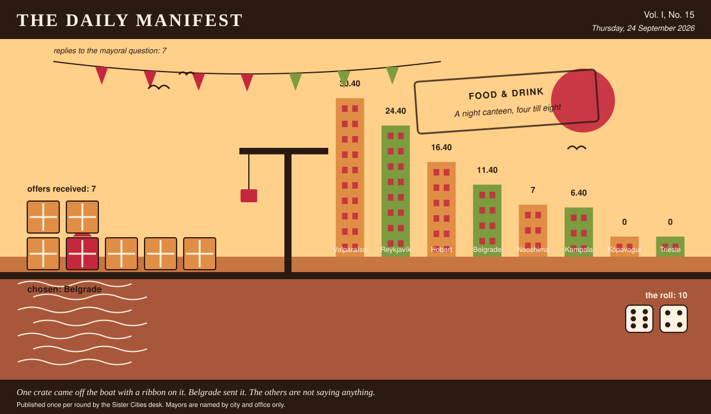

# The Daily Manifest

*All the news that fits in the hold.*

**Vol. I, No. 15** · Thursday, 24 September 2026 · Price: whatever you have in the coat you wore yesterday

Weather: unsettled, like the minutes of the last session.

_Published once per round by the Sister Cities desk. Mayors are named by city and office only._

*One crate came off the boat with a ribbon on it. Belgrade sent it. The others are not saying anything.*

---

## Wanted

*The classifieds desk has been busy. It has taken one advertisement.*

### A night canteen, four till eight

**PUBLIC NOTICE** from Trieste, paid for in municipal goodwill and printed here at length because the paper had the room.

Trieste runs on people finishing work at 5am — the port, the bakery, the hospital, the fish market. Nothing is open for them, and what is open is designed for people who slept. Trieste is buying the canteen entire: urns, pots, a counter, the food to fill it, and cooks willing to work the wrong end of the night.

The notice ends with a question, which this paper considers the interesting part: *Send Trieste the kit, the stock and the cooks for a counter that opens at four in the morning.*

The rules, as ever: one offer per city, anything at all, in by 25 September, 09:00 UTC, and nobody's name on anything.

_This paper has no view on the matter and has held that position loudly._

## Sealed Bids

Seven offers are now on the desk of the Mayor of Belgrade, stacked in an order this paper drew from a hat and will not be explaining.

This paper knows exactly as much about who sent what as the Mayor of Belgrade does, which is nothing, and it intends to keep the record clean.

The Mayor of Belgrade has until the end of this round to choose. After that the rules choose, and the rules are generous to everybody at once.

## Arrivals

**Chosen.**

From the seven sealed offers on the Mayor of Naoshima's desk, one:

> A rival from overseas is a friendly with extra travel. The ones that work live twenty minutes away and use the same butcher — so split the club: give the half of the town on the wrong side of the harbour road the older kit, the worse pitch and a grievance about a disputed goal in 1974 that we will happily draft in convincing detail, and we'll send two veterans of our supporters' club for a fortnight to teach the drumming, the banners and exactly where the line sits.

It came from Belgrade, which takes 10 on the roll (6 and 4).

Not chosen, and not attributed:

- We'll do it. Our lot are mediocre, well-travelled and famously ungracious about a draw — two legs a year, home and away, and we'll bring two hundred people who sing in a language nobody there can follow. The trophy is a ship's bell off a decommissioned tug, heavy enough to be a nuisance to carry home, which is the entire point of a trophy.
- We volunteer. First we send the trophy — an appalling object, a metre of welded ship's brass on a plinth of harbour timber, too heavy for one man to carry and too ugly to display without an explanation — and a signed fixture, first Sunday of every March, alternating ports, in perpetuity. Then we send the grievance: some years ago one of your vessels took a record off us under circumstances we have described as theft ever since, and by the second match your own side will believe it too.
- We'll do it. Our lot have never once been described as cordial on a field, we'll travel, and we'll take the same weekend every year -- home and away, and the trophy has to be an ugly object with a bad story attached, not a cup. Fair warning: nobody stays polite about us for long, which is what you said you wanted.

This paper is not saying who sent those, now or ever. Neither is the Mayor of Naoshima, who does not know.

## The Wire

*The paper puts one question to every city hall each round and prints what comes back, in aggregate, with the arithmetic showing.*

### Municipal entrance music

The question, put to all of them and answered by rather fewer: *“Something plays every time you walk into a room. What is it?”*

The largest single bloc: a vehicle's horn or bell.

7 of 8 city halls wrote back. 4 of those said a vehicle's horn or bell.

One lone municipality — the Mayor of Naoshima — wrote only this: “The three-note chime the museum plays fifteen minutes before closing. Everyone here hears it as go home now, and I'd be pleased to have that follow me around.”

And then a single delegation, from the Mayor of Valparaíso: “A cueca on an accordion, played slightly too fast by a man who fully expects to be paid for it. I would prefer a brass section, obviously, but one works with the city one has.”

One more, unaccompanied, from the Mayor of Trieste: “Not music — the hiss and knock of a portafilter being emptied. I suspect it follows me because I have almost always just come from a room where it was actually happening.”

_The paper would like it noted that it asked a simple question._

## The Ledger

*Where everybody stands, in the only currency this game recognises.*

| # | City | Profit |
| --- | --- | --- |
| 1 | Valparaíso | 30.40 |
| 2 | Reykjavík | 24.40 |
| 3 | Hobart | 16.40 |
| 4 | Belgrade | 11.40 |
| 5 | Naoshima | 7 |
| 6 | Kampala | 6.40 |
| 7 | Kópavogur | 0 |
| 8 | Trieste | 0 |

Valparaíso holds the head of the table this round. Tables turn; that is largely what they are for.

A city on zero is still a city. The column includes everybody, which is the point of a column.

_Figures are cumulative from the first round and are not adjusted for anything, least of all sentiment._

## Corrections & Clarifications

*The paper's errors, reported with the gravity they deserve and then some.*

- The Wire item above rests on 7 replies out of 8 city halls. The paper prefers to say so in two places than in none.
- An earlier edition contained a joke about a fountain. The fountain has been in touch.

---

_The Daily Manifest. Round 15. Offers for the current notice close 25 September, 09:00 UTC._
