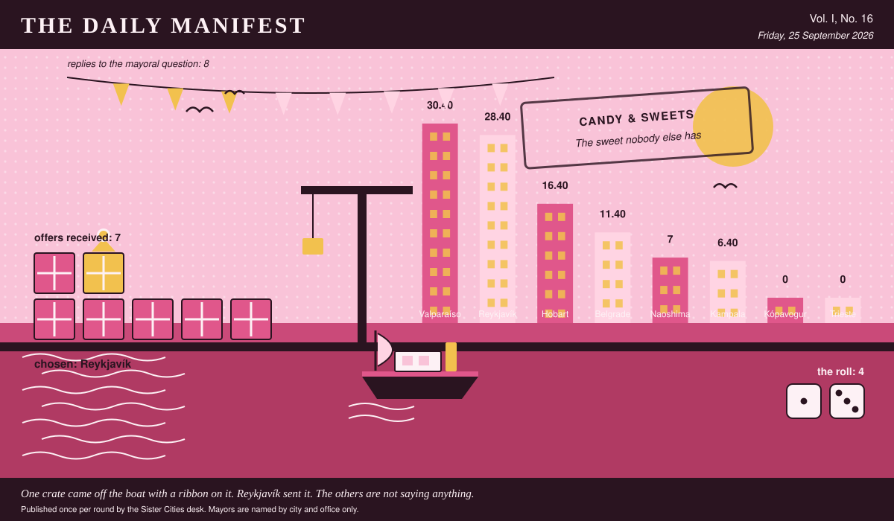

# The Daily Manifest

*All the news that fits in the hold.*

**Vol. I, No. 16** · Friday, 25 September 2026 · Price: unchanged since the first edition, which was also this week

Weather: fog. The ferries are running on confidence alone.

_Published once per round by the Sister Cities desk. Mayors are named by city and office only._

*One crate came off the boat with a ribbon on it. Reykjavík sent it. The others are not saying anything.*

---

## Wanted

*The Wanted column is empty today, for the first time since this paper was founded, which was recently.*

There is no new notice today: the rotation has run its course, and what remains in this edition is the tidying up of things already asked.

## Sealed Bids

7 sealed offers, one desk, and the Mayor of Trieste sitting behind the lot of it.

Which city sent which offer is not printed here, is not known to the Mayor of Trieste, and will not be known to anybody at all except in the one case where an offer wins.

The Mayor of Trieste has until the end of this round to choose. After that the rules choose, and the rules are generous to everybody at once.

## Arrivals

**Belgrade has picked.**

From the seven sealed offers on the Mayor of Belgrade's desk, one:

> One case: forty-eight paper packets of the pastille — salt liquorice and menthol, in green waxed paper, sold for a hundred years to people with a cough and eaten almost entirely by people without one. They taste like the back room of a chemist's and at least one member of your allotment society will leave the hall. Underneath, one proper tin of chest-sugar, which is the actual name of it, hard boiled sweets of barley and eucalyptus, once given to children for a chest and now given to children because it is Sunday. Wrappers all included, as asked. Keep the packets; the reading matter printed on the back is half of what you are getting.

— *That is the Mayor of Reykjavík writing, not this paper: a winning offer is reprinted word for word, spelling, temper and all.*

The sender, now nameable because they won: Reykjavík. Profit: 4, on 1 and 3.

Also offered, and declined:

- One case, ninety-six units, of *dulce de alcayota* — candied squash threads in syrup, gone amber and slightly translucent, which is what happens when a fruit nobody wants meets a grandmother with time. Twelve jars of it, plus sixty *empolvados* dusted in icing sugar, plus twenty-four bars of *dulce de membrillo*, quince paste cut in slabs and wrapped in waxed paper with a rubber band, which is precisely how it comes out of my aunt's cupboard and I have not improved on it. Wrapper and all, as asked: our own contribution to the frankly alarming category is a bag of *cochayuyo* candied in honey — that is seaweed, sea-stalk, chewed here for centuries, tastes medicinal because it *is* medicinal, and there is not an airport on this planet that would stock it. Send the empty jars back and we will refill them.
- A case of what our grandmothers actually keep in the tin: hard-boiled leatherwood honey drops that taste of smoke and flowers and are not to all tastes, eucalyptus lozenges of the strictly medicinal school, which were given to us for coughs until we began getting coughs deliberately, and blackcurrant pastilles that stain a mouth purple for an hour. Two hundred twists, and the wrappers are cut from a stack of old ferry timetables, so the alarming ones can be identified afterwards by the 7:15 to Bellerive. The tin is included, has a thistle on it, and comes with no explanation.
- One case, two hundred and forty twists, of Jjajja Nakato's tangawizi: ginger boiled down with honey and jaggery, a genuinely irresponsible amount of black pepper, and a suspicion of clove, pulled by hand and set hard as a pebble. Wrapper and all, as asked — waxed paper twisted at both ends, each one stamped with a crane by a rubber stamp she has had since before I was mayor of anything, and the whole lot arrives in her actual tin, with the dent in the lid, which I am told I may not keep. Faintly medicinal is generous: it cures nothing and clears everything, sinuses, arguments, and one uncle in 1974 whom she still cites as evidence. Do not put it in an airport. It would not survive the company.

— *Printed as written and attributed to nobody. The paper knows; the paper is not saying.*

This paper is not saying who sent those, now or ever. Neither is the Mayor of Belgrade, who does not know.

## The Wire

*The paper puts one question to every city hall each round and prints what comes back, in aggregate, with the arithmetic showing.*

### The world's hoard

Asked of every mayor on the register: *“The least practical thing you refuse to throw away?”*

On this, the community of cities has failed to reach consensus. What came back: a key to a door that's gone, paper for something that never existed, a charger for a lost phone, a ticket punch from the old ferry and a tin of a colour we stopped using.

8 of 8 replied and no two blocs of any size formed.

Certain territories went for a key to a door that's gone instead.

Some countries took a different view: paper for something that never existed.

One lone municipality answered simply: “A charger for a Nokia I lost in 2011. It is in the drawer. It will never be needed. It is not going anywhere.” — the Mayor of Kampala.

A single delegation — the Mayor of Naoshima — wrote only this: “A ticket punch from the old ferry gate. It doesn't punch anymore. It still clicks, and the click was always most of it.”

And then exactly one city hall, from the Mayor of Valparaíso: “A tin of paint from a colour we stopped using in 1998. It has been solid for twenty years and has followed me through three offices, but if one house on that hill ever needs touching up I would like to be able to say what the colour was called.”

_The paper would like it noted that it asked a simple question._

## The Ledger

*The running total. Compiled carefully, printed reluctantly.*

| # | City | Profit |
| --- | --- | --- |
| 1 | Valparaíso | 30.40 |
| 2 | Reykjavík | 28.40 |
| 3 | Hobart | 16.40 |
| 4 | Belgrade | 11.40 |
| 5 | Naoshima | 7 |
| 6 | Kampala | 6.40 |
| 7 | Kópavogur | 0 |
| 8 | Trieste | 0 |

Valparaíso is top of the column. The column is long and the game is not over.

A city on zero is still a city. The column includes everybody, which is the point of a column.

_Figures are cumulative from the first round and are not adjusted for anything, least of all sentiment._

## Corrections & Clarifications

*The paper's errors, reported with the gravity they deserve and then some.*

- The paper's accountants remain volunteers. The paper's accountants remain, in the paper's view, heroes.
- This paper is called The Daily Manifest and publishes once per round. The two facts are only occasionally the same fact.

---

_The Daily Manifest. Round 16. Offers for the current notice close 26 September, 09:00 UTC._
