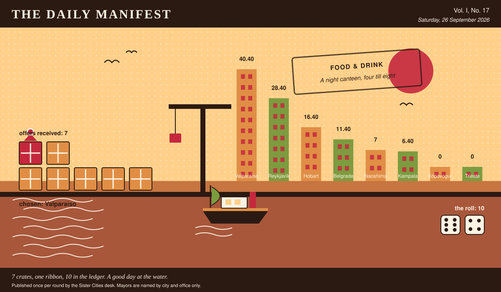

# The Daily Manifest

*All the news that fits in the hold.*

**Vol. I, No. 17** · Saturday, 26 September 2026 · Price: unchanged since the first edition, which was also this week

Weather: unsettled, like the minutes of the last session.

_Published once per round by the Sister Cities desk. Mayors are named by city and office only._

*7 crates, one ribbon, 10 in the ledger. A good day at the water.*

---

## Wanted

*No new notice. The classifieds desk has gone to look at the harbour.*

There is no new notice today: the rotation has run its course, and what remains in this edition is the tidying up of things already asked.

## Sealed Bids

No window closed today. The offers currently in transit remain in transit.

## Arrivals

**A decision, and promptly.**

The winning offer for Trieste, reproduced exactly as it arrived:

> *Chorrillana*, disassembled for travel, thirty portions: vacuum-packed strips of beef, sliced onion in its own bag, and the potatoes cut into batons and blanched and frozen because that is the only honest way to move a chip across an ocean. Thirty eggs travel separately and go on top at the last second, still soft, and the whole thing is fried in one pan and tipped out in one heap — this is the food of eleven at night, standing, in a bar with a tiled floor and a man playing guitar at nobody. You eat it out of the pan. Not a plate: the shallow steel pan it was cooked in, set straight down on the counter with four forks in it and no one appointed to divide it fairly, which is the entire tradition. We are sending thirty pans, and a bottle of *pisco* to be drunk by whoever is still standing at one.

The sender, now nameable because they won: Valparaíso. Profit: 10, on 6 and 4.

Not chosen, and not attributed:

- Two hundred lamb sausages, vacuum-packed and frozen; twelve tubs of remoulade; six tins of sweet brown mustard; four kilos of crisp fried onion in sealed bags; and a sack of raw onion, which you chop small yourself. That is one snack, assembled in that order at a kiosk window at eleven at night, and it is eaten out of a folded paper napkin, standing up, with your back to whatever the wind is doing. Also two crates of dried fish in strips, vacuum-packed, and a pound of butter: no cooking, no plate, you tear a piece, butter it, and eat it out of your own hand. Both keep for months. Neither of them wants a table, which I understand is the whole point of eleven o'clock.
- Three hundred curried scallop pies, frozen hard, packed in dry ice: shortcrust, a yellow sauce the exact colour of a wet raincoat, and scallops out of the channel rather than out of a bag from somewhere else. They are eaten standing on a wharf at eleven at night out of a flat white paper bag folded down twice, back to the wind, sauce running towards the wrist, which is the point rather than the fault. Two thousand bags in the crate, and four hundred wooden forks nobody will use. Twenty minutes in a real oven; whoever microwaves one has ended the exercise for everybody.
- The snack is the rolex, eaten standing at eleven at night at a stall with one bulb, and it travels better than anyone expects: six hundred chapatis vacuum-packed in stacks of six and still soft, eight kilos of the cabbage-tomato-onion-chilli mix sealed in tubs, and a tin of the spice, because eggs are the one thing anybody can find for themselves at that hour. What you eat it out of is a torn triangle of yesterday's newspaper, one hand, no plate, ever — a plate turns it into dinner and ruins the whole institution — so I have sent a bale of last week's papers to see the first three hundred done properly. And Tonny is in the crate too, or rather beside it, with his oil drum and his flat blade; he rolls one in forty seconds and he will not tell you what is in the spice tin. You have been hungry at eleven for years without mentioning it. Mention it.

Those arrived unsigned and will stay that way. A losing offer's city is nobody's business, permanently.

## The Wire

*The paper puts one question to every city hall each round and prints what comes back, in aggregate, with the arithmetic showing.*

### The question, and what came back of it

The question, put to all of them and answered by rather fewer: *“What smell means home?”*

The postbag was empty. The paper has re-read the question and concedes it may have been a lot to ask on a busy round.

_The paper would like it noted that it asked a simple question._

## The Ledger

*Where everybody stands, in the only currency this game recognises.*

| # | City | Profit |
| --- | --- | --- |
| 1 | Valparaíso | 40.40 |
| 2 | Reykjavík | 28.40 |
| 3 | Hobart | 16.40 |
| 4 | Belgrade | 11.40 |
| 5 | Naoshima | 7 |
| 6 | Kampala | 6.40 |
| 7 | Kópavogur | 0 |
| 8 | Trieste | 0 |

Valparaíso holds the head of the table this round. Tables turn; that is largely what they are for.

Several cities are still on nothing at all. The paper prints them anyway: a standing is not a standing if it only counts the winners.

_Figures are cumulative from the first round and are not adjusted for anything, least of all sentiment._

## Corrections & Clarifications

*Small retractions, offered at full volume.*

- This paper prints mayors by city and office only. A reader who wrote in asking for full names has been thanked for their interest.
- An earlier edition contained a joke about a fountain. The fountain has been in touch.

---

_The Daily Manifest. Round 17. Offers for the current notice close 27 September, 09:00 UTC._
