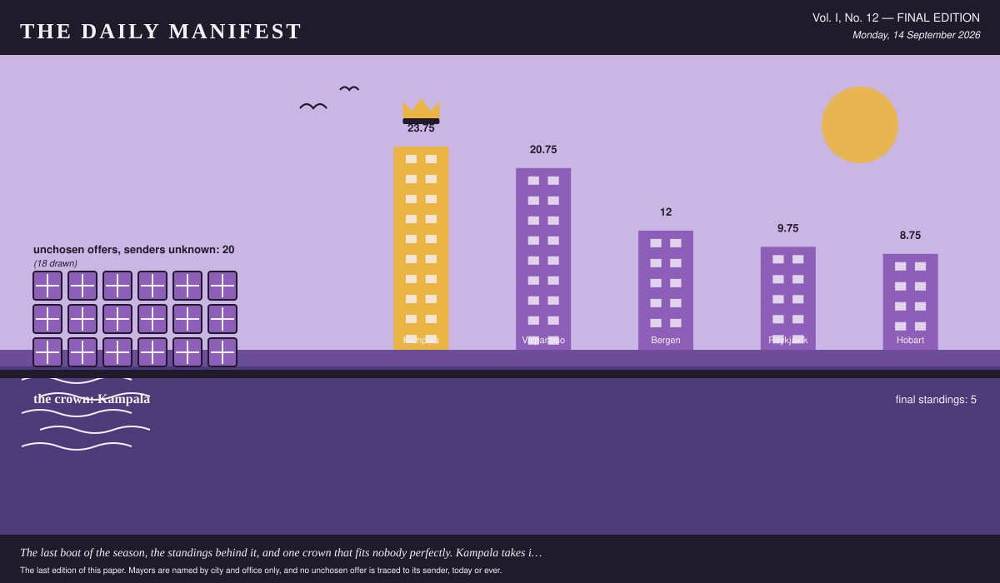

# The Daily Manifest

*All the news that fits in the hold.*

**Vol. I, No. 12 — FINAL EDITION** · Monday, 14 September 2026 · Price: free to city halls, exorbitant to everyone else

Weather: fog. The ferries are running on confidence alone.

_The last edition of this paper. Mayors are named by city and office only, and no unchosen offer is traced to its sender, today or ever._

*The last boat of the season, the standings behind it, and one crown that fits nobody perfectly. Kampala takes it anyway.*

---

## The Crown

*The final figures, certified by this paper's accountants, who have asked to be described as exhausted.*

**The crown goes to Kampala.** 35.75, cumulative, from the first notice to the last.

Valparaíso finished 18 behind — a gap this paper considers both narrow and, now, permanent.

Four of Kampala's offers were chosen over the run of the game, which is a good year at the water.

Kampala also took a full roll for solving its own problem, the world having sent it nothing whatsoever that round.

| # | City | Final profit |
| --- | --- | --- |
| 1 | Kampala | 35.75 |
| 2 | Valparaíso | 17.75 |
| 3 | Hobart | 15.75 |
| 4 | Reykjavík | 5.75 |
| 5 | Bergen | 0 |

_Final figures, cumulative from the first round, unadjusted for luck, weather, or the strength of anybody's feelings._

5 cities played to the end. All 5 are, in this paper's assessment, still standing.

_Of all the parties to this game, only this paper has profited purely in reputation, and it intends to spend that too._

## Consequences

*A year of international goodwill has had effects. This desk has been asked to look into them.*

The trade is finished, the ledger is closed, and 12 things are now permanently in places that were not built for them. This paper has been to see most of them.

> Four hundred metres of bunting in the colours the hills painted themselves, ladders included.

— *The Mayor of Valparaíso's own words, unaltered. What they did after arriving is a separate matter, below.*

Valparaíso wrote that. Reykjavík read it, wanted it, and took delivery of it against the notice titled "Window boxes for one long grey street".

It has taken to Reykjavík magnificently, in every direction, and through one wall.

> Roast maize, chapati and a spice mix in unlabelled bags, because labels slow everything down.

— *The offer as the Mayor of Kampala wrote it, which is how it was read and how it is printed here.*

Kampala wrote that. Hobart read it, wanted it, and took delivery of it against the notice titled "Outfitting for a swimming club that swims in March".

Everybody in Hobart is warm, visible from a distance, and has entirely stopped mentioning the weather.

> Wool socks in colours our grandmothers chose. A thousand pairs, all slightly wrong.

— *The offer as the Mayor of Reykjavík wrote it, which is how it was read and how it is printed here.*

Reykjavík wrote that. Valparaíso read it, wanted it, and took delivery of it against the notice titled "Board games for a wet fortnight".

There is a league in Valparaíso now. There is also, already, a disputed result.

> Two hundred waxed cotton raincoats, unbeautiful, tested annually by the actual weather.

— *The Mayor of Hobart's own words, unaltered. What they did after arriving is a separate matter, below.*

Hobart wrote that. Bergen read it, wanted it, and took delivery of it against the notice titled "Cordial, for two hundred jugs".

Every fridge in Bergen is now one crate fuller than it was designed to be, and three doors no longer shut.

The industry Kampala ramped up when nobody answered its notice has not been ramped back down. It has a logo, a rota and an opinion about the harbour.

Bergen's lapsed deliberation paid 4 cities at once, and 4 cities have since referred to it as a mandate.

None of the above is the half of it. Over the whole game twenty offers were sent and not chosen, and every one of them went home again: window boxes, planted, unwatered, swimming kit, dry, folded, unused, board games, boxed, one piece short, hot water bottles, cooling, in a cupboard, late suppers, arriving at the wrong hour, paperbacks, unread, spines uncracked, prizes, unclaimed, back in the box and beans, unground, losing their nerve. That is what the world made this year and could not give away.

The senders of the unwanted are not named here. They were not named at the time, they are not named at the end, and the last edition is not a late confession.

_No city hall has accepted responsibility for any of the above, which this paper regards as the most professional conduct of the entire game._

## The Excess

*One portrait per city, drawn from what it asked the world for, what the world kept, and what it could not find a use for.*

### Bergen

*The portrait of Bergen: notices, ribbons, leftovers, and one closed door.*

Bergen, fifth on 0, drawn here from its own record and nobody else's.

Bergen's notices this game: Cordial, for two hundred jugs and Coffee that does not taste of the urn. Two in total, each one a thing it wanted and could not get at home.

Nothing in this paper's whole arrivals column came from Bergen. The column is the poorer for it and has said so.

Bergen's deliberation once outlasted its own window, and 4 cities were paid for it.

Three offers reached Bergen and went unchosen. Bergen kept the pile anyway — beans, unground, losing their nerve — because nobody has ever worked out how to send an offer back.

From that pile, unattributed as ever:

- A market's worth of Saturday, transplanted whole, noise included.
- Six thousand alfajores, packed in tins that families here reuse for thirty years.

— *Offers this city turned down, in the words they came in. No senders named, this year or any year.*

Kept in the crate: one offer matching, sentence for sentence, an offer credited by name elsewhere in this edition — the same words having won somewhere and lost here.

Bergen's own unchosen offers exist, are somewhere in Bergen, and are nobody's business. The portrait draws the door and stops there.

Asked *What is on the mayoral desk that has absolutely no business being there?*, the Mayor of Bergen said: “A barometer that has been wrong since April.” This paper has thought about that a good deal since.

### Hobart

*The portrait of Hobart: notices, ribbons, leftovers, and one closed door.*

Hobart finishes third, on 15.75, and looks — the illustrator is firm about this — exactly like a city that finished third on 15.75.

What Hobart asked for, in order: Outfitting for a swimming club that swims in March and The thing you eat standing up at eleven at night.

Three times this game, a city read an unsigned offer and it turned out to be Hobart's.

Bergen looked at a desk of unsigned offers and took Hobart's: *Two hundred waxed cotton raincoats, unbeautiful, tested annually by the actual weather.*

Four offers reached Hobart and went unchosen. Hobart kept the pile anyway — swimming kit, dry, folded, unused and late suppers, arriving at the wrong hour — because nobody has ever worked out how to send an offer back.

From that pile, unattributed as ever:

- Salted liquorice, forty cases, which visitors have twice described as a prank.
- Six thousand alfajores, packed in tins that families here reuse for thirty years.

— *Offers this city turned down, in the words they came in. No senders named, this year or any year.*

Hobart's own unchosen offers exist, are somewhere in Hobart, and are nobody's business. The portrait draws the door and stops there.

For the record, the Mayor of Hobart, asked *What was the last thing that made you laugh out loud, on your own?*: “A dog on the ferry who clearly commutes.”

### Kampala

*The portrait of Kampala: notices, ribbons, leftovers, and one closed door.*

Kampala finishes first, on 35.75, and looks — the illustrator is firm about this — exactly like a city that finished first on 35.75.

Kampala came to the world two times, over Biscuits, by the tin, for a hall with three bookings and Prizes for a fête, and nothing sensible.

Four times this game, a city read an unsigned offer and it turned out to be Kampala's.

Chosen, in Valparaíso, from Kampala: *Two hundred paperbacks from the stall by the taxi park, no two alike, and the one I nearly kept is a stupid little book about drainage that I have now read four times.*

When nobody answered Kampala's notice, Kampala built the answer itself. The shed is in the picture.

The excess at Kampala: three offers, declined, filed under prizes, unclaimed, back in the box, occupying a quay that has other uses.

Two offers, reprinted without a sender, because the writing deserves a second reading:

- Rain, in quantity, and the raincoats to shrug at it.
- Apples, forty cases, in six varieties nobody off this island has heard of.

— *Offers this city turned down, in the words they came in. No senders named, this year or any year.*

Also withheld: one offer reading word for word like something this paper has already credited to a city elsewhere in today's edition. An unattributed reprint would be a riddle with the answer two columns up.

What Kampala sent that nobody chose is not itemised here and cannot be: this paper has never known which offers were Kampala's, and the one ledger that does know is not something the last edition gets to open. There is a shed for it in the portrait, with the door shut.

On the question *Best thing you have ever eaten standing up?*, Kampala's answer was: “Roast maize from a woman on Jinja Road who has never once been wrong.”

### Reykjavík

*Reykjavík at the end of the game, with 4 declined offers behind it and the shed door shut on the rest.*

Fourth: Reykjavík, 5.75, and a harbour that has seen things this year.

Reykjavík came to the world two times, over Window boxes for one long grey street and Four hundred hot water bottles, and the covers for them.

Two of Reykjavík's offers were chosen across the game, each of them picked by a mayor who did not know whose it was.

Valparaíso looked at a desk of unsigned offers and took Reykjavík's: *Wool socks in colours our grandmothers chose. A thousand pairs, all slightly wrong.*

Four offers reached Reykjavík and went unchosen. Reykjavík kept the pile anyway — window boxes, planted, unwatered and hot water bottles, cooling, in a cupboard — because nobody has ever worked out how to send an offer back.

From that pile, unattributed as ever:

- Apples, forty cases, in six varieties nobody off this island has heard of.
- Fish soup in vacuum packs, and a two-hundred-year opinion about freshness.

— *Offers this city turned down, in the words they came in. No senders named, this year or any year.*

Reykjavík's own unchosen offers exist, are somewhere in Reykjavík, and are nobody's business. The portrait draws the door and stops there.

On the question *What is on the mayoral desk that has absolutely no business being there?*, Reykjavík's answer was: “A pebble from a beach that no longer exists.”

### Valparaíso

*The portrait of Valparaíso: notices, ribbons, leftovers, and one closed door.*

Valparaíso finishes second, on 17.75, and looks — the illustrator is firm about this — exactly like a city that finished second on 17.75.

Valparaíso's notices this game: Board games for a wet fortnight and Something for the shelf by the door. Two in total, each one a thing it wanted and could not get at home.

Three times this game, a city read an unsigned offer and it turned out to be Valparaíso's.

The world kept this, from Valparaíso: *A brass band with its own van, its own repertoire, and no intention of stopping at ninety minutes.* — chosen in Bergen.

The excess at Valparaíso: six offers, declined, filed under board games, boxed, one piece short and paperbacks, unread, spines uncracked, occupying a quay that has other uses.

From that pile, unattributed as ever:

- Rain, in quantity, and the raincoats to shrug at it.
- A market's worth of Saturday, transplanted whole, noise included.

— *The unchosen, printed as written and signed by nobody at all.*

Withheld as well: one offer that wrote a city into the text. The rule outlives the game.

What Valparaíso sent that nobody chose is not itemised here and cannot be: this paper has never known which offers were Valparaíso's, and the one ledger that does know is not something the last edition gets to open. There is a shed for it in the portrait, with the door shut.

On the question *Best thing you have ever eaten standing up?*, Valparaíso's answer was: “An empanada from a window on Cerro Alegre, eaten walking.”

_That is the world, as far as this paper was able to establish it, and establishing it was the whole job._

---

_The Daily Manifest. The final edition. There is no notice open, no window closing, and nothing further to send._
