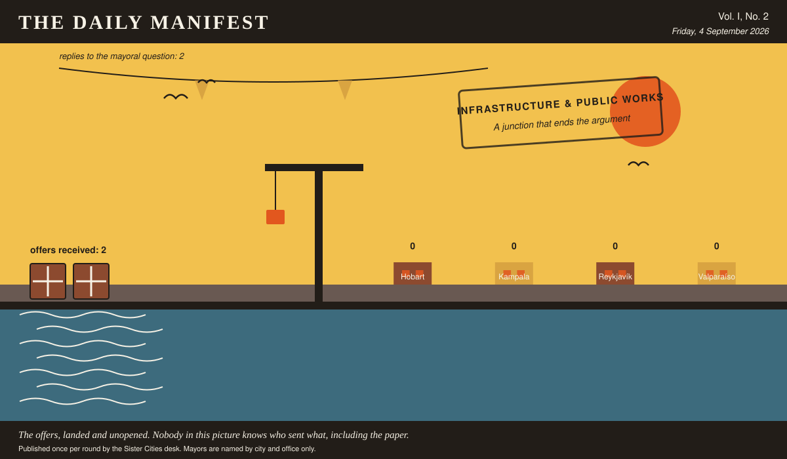

# The Daily Manifest

*All the news that fits in the hold.*

**Vol. I, No. 2** · Friday, 4 September 2026 · Price: whatever you have in the coat you wore yesterday

Weather: wind from the harbour, opinions from everywhere.

_Published once per round by the Sister Cities desk. Mayors are named by city and office only._

*The offers, landed and unopened. Nobody in this picture knows who sent what, including the paper.*

---

## Wanted

*The classifieds desk has been busy. It has taken one advertisement.*

### Windbreak for one avenue, bolted down

**PUBLIC NOTICE** from Hobart, paid for in municipal goodwill and printed here at length because the paper had the room.

The wind comes down Hobart's main avenue at a speed that has removed four awnings, one election banner and the dignity of most residents between November and March. Purchase order: screens, baffles, slats, canvas, rope, planters heavy enough to stay put, and a crew to bolt it all down before the first gale.

The notice ends with a question, which this paper considers the interesting part: *Ship Hobart the windbreak for a four-kilometre avenue, and the crew who fix it in place.*

Offers close at the end of this round (5 September, 09:00 UTC). One per city hall, freeform, sealed. Which city sent which will not be printed here, and will not reach the Mayor of Hobart either.

_Treating the sky as a procurement problem has never once worked, and city halls keep trying._

## Sealed Bids

2 sealed offers, one desk, and the Mayor of Reykjavík sitting behind the lot of it.

Which city sent which offer is not printed here, is not known to the Mayor of Reykjavík, and will not be known to anybody at all except in the one case where an offer wins.

The Mayor of Reykjavík has until the end of this round to choose. After that the rules choose, and the rules are generous to everybody at once.

## Arrivals

No arrivals. The quay is swept, the crane is idle, and two gulls have taken the opportunity to occupy a bollard each.

## The Wire

*Correspondence from the mayors, counted before it was quoted.*

### From the postbag

The question, put to all of them and answered by rather fewer: *“Best thing you have ever eaten standing up?”*

The only two delegations to reply, so this paper declines to speak for the world. Kampala says: “Roast maize from a woman on Jinja Road who has never once been wrong.” Valparaíso says: “An empanada from a window on Cerro Alegre, eaten walking.”

The paper asked 4 and heard from 2. It is printing the answers and no arithmetic.

_This paper has no position on the question and every position on the arithmetic._

## The Ledger

*Where everybody stands, in the only currency this game recognises.*

| # | City | Profit |
| --- | --- | --- |
| 1 | Hobart | 0 |
| 2 | Kampala | 0 |
| 3 | Reykjavík | 0 |
| 4 | Valparaíso | 0 |

4 cities are level on 0 and each has written in separately to say they are not.

Several cities are still on nothing at all. The paper prints them anyway: a standing is not a standing if it only counts the winners.

_Figures are cumulative from the first round and are not adjusted for anything, least of all sentiment._

## Corrections & Clarifications

*The paper's errors, reported with the gravity they deserve and then some.*

- The Wire item above rests on 2 replies out of 4 city halls. The paper prefers to say so in two places than in none.
- The paper's accountants remain volunteers. The paper's accountants remain, in the paper's view, heroes.

---

_The Daily Manifest. Round 2. Offers for the current notice close 5 September, 09:00 UTC._
