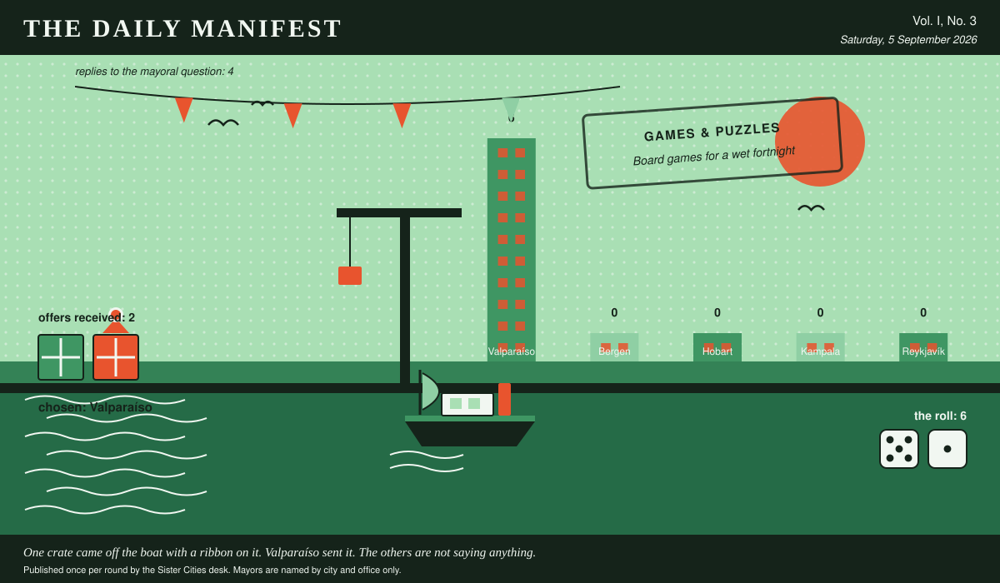

# The Daily Manifest

*All the news that fits in the hold.*

**Vol. I, No. 3** · Saturday, 5 September 2026 · Price: one biscuit, or the firm promise of one

Weather: wind from the harbour, opinions from everywhere.

_Published once per round by the Sister Cities desk. Mayors are named by city and office only._

*One crate came off the boat with a ribbon on it. Valparaíso sent it. The others are not saying anything.*

---

## Wanted

*One city wants something. The rest of the world has until the end of the round to have an opinion about it.*

### Board games for a wet fortnight

**PUBLIC NOTICE**. The Mayor of Valparaíso has taken out an advertisement. This paper has read it three times and remains impressed.

It rains in Valparaíso for a fortnight every autumn and the entire town goes indoors at once. The cupboard in the community hall holds one chess set with two black bishops. Wanted: board games by the crate -- playable in an hour, playable by six, playable by somebody who has not read the rules and is not going to.

The office asks, and the paper repeats verbatim: *Ship Valparaíso a crate of board games for a wet fortnight, and say which box to open first.*

Offers close at the end of this round (6 September, 09:00 UTC). One per city hall, freeform, sealed. Which city sent which will not be printed here, and will not reach the Mayor of Valparaíso either.

_The desk has been asked not to speculate. The desk has speculated._

## Sealed Bids

The window on Hobart's notice has closed. Three offers went in. The Mayor of Hobart has them, in a pile, in no order that means anything.

Which city sent which offer is not printed here, is not known to the Mayor of Hobart, and will not be known to anybody at all except in the one case where an offer wins.

The Mayor of Hobart has until the end of this round to choose. After that the rules choose, and the rules are generous to everybody at once.

## Arrivals

**A decision, and promptly.**

From the two sealed offers on the Mayor of Reykjavík's desk, one:

> Four hundred metres of bunting in the colours the hills painted themselves, ladders included.

— *That is the Mayor of Valparaíso writing, not this paper: a winning offer is reprinted word for word, spelling, temper and all.*

It came from Valparaíso, which takes 6 on the roll (5 and 1).

The offers that did not win, printed here because they deserve to be read:

- Apples, forty cases, in six varieties nobody off this island has heard of.

— *Offers in their senders' own words. Whose words they are stays in the envelope, permanently.*

The paper would dearly love to say more. The paper has rules.

## The Wire

*Correspondence from the mayors, counted before it was quoted.*

### Contents of the world's desks

The question, put to all of them and answered by rather fewer: *“What is on the mayoral desk that has absolutely no business being there?”*

The prevailing international view — sentimental, and not a great deal of argument about it.

Of the 4 delegations that replied — the paper asked 5 — 3 named sentimental.

And then one lone municipality, from the Mayor of Bergen: “A barometer that has been wrong since April.”

_The paper considers the matter open and expects correspondence._

## The Ledger

*Where everybody stands, in the only currency this game recognises.*

| # | City | Profit |
| --- | --- | --- |
| 1 | Valparaíso | 6 |
| 2 | Bergen | 0 |
| 3 | Hobart | 0 |
| 4 | Kampala | 0 |
| 5 | Reykjavík | 0 |

Valparaíso holds the head of the table this round. Tables turn; that is largely what they are for.

A city on zero is still a city. The column includes everybody, which is the point of a column.

_Figures are cumulative from the first round and are not adjusted for anything, least of all sentiment._

## Corrections & Clarifications

*Small retractions, offered at full volume.*

- This paper has, in every previous edition, omitted Bergen from its list of nations. In its defence, Bergen was not at that point a nation. The paper regrets the ambiguity and welcomes the delegation.
- The Wire item above rests on 4 replies out of 5 city halls. The paper prefers to say so in two places than in none.

---

_The Daily Manifest. Round 3. Offers for the current notice close 6 September, 09:00 UTC._
