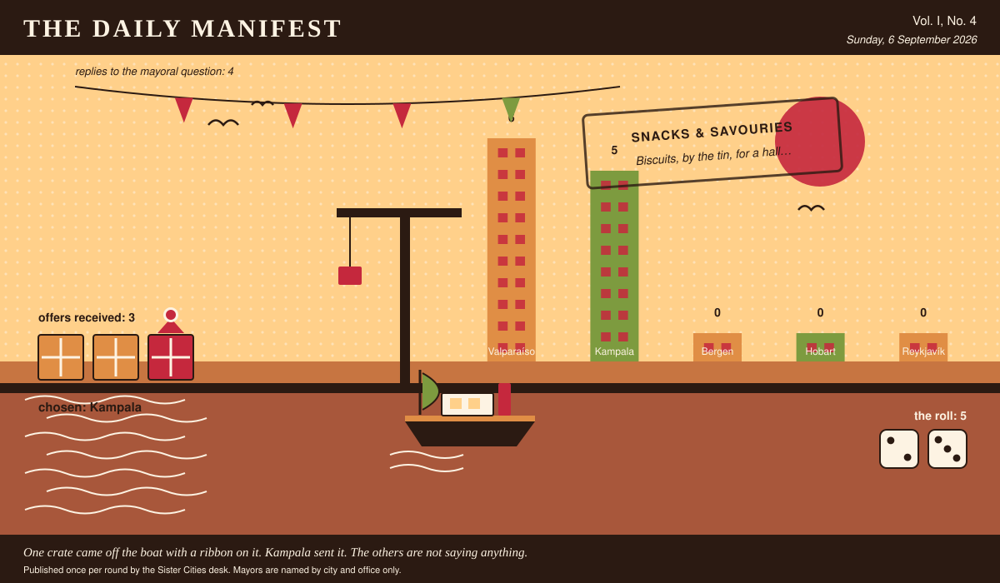

# The Daily Manifest

*All the news that fits in the hold.*

**Vol. I, No. 4** · Sunday, 6 September 2026 · Price: free to city halls, exorbitant to everyone else

Weather: bright, briefly, and then a meeting.

_Published once per round by the Sister Cities desk. Mayors are named by city and office only._

*One crate came off the boat with a ribbon on it. Valparaíso sent it. The others are not saying anything.*

---

## Wanted

*One city wants something. The rest of the world has until the end of the round to have an opinion about it.*

### Preservation, for ninety thousand plums

**PUBLIC NOTICE**, filed by the Mayor of Kampala under Food & Drink, which is where Kampala files most things.

A clerical error in Kampala's orchard subsidy has produced a plum harvest roughly nine times the town's historical plum appetite. They are ripening on schedule and entirely without mercy. Kampala will buy freezers, presses, drying racks, salt, sugar, casks, reefer containers, jars — and the hands to run them — delivered inside nine days.

The office asks, and the paper repeats verbatim: *Ship Kampala what keeps ninety thousand plums, and say how fast it can be on the quay.*

Every other city hall may send exactly one offer, in whatever form it likes, by 7 September, 09:00 UTC. The offers arrive unsigned, and the Mayor of Kampala will read them that way.

_The paper's staff have volunteered, unanimously and immediately, to assess any samples._

## Sealed Bids

The window on Valparaíso's notice has closed. Four offers went in. The Mayor of Valparaíso has them, in a pile, in no order that means anything.

The offers are unsigned. That is not the paper being coy; it is the rule, and it holds after the vote as firmly as before it.

One round to decide. A window that closes without a decision is not a disaster, merely an expensive kind of politeness.

## Arrivals

**A decision, and promptly.**

The winning offer for Hobart, reproduced exactly as it arrived:

> A hillside's worth of paint, in colours the council will argue about for years.

The sender, now nameable because they won: Valparaíso. Profit: 5, on 2 and 3.

Also offered, and declined:

- Eleven boda riders who know every shortcut and will not be told otherwise.
- A retired harbourmaster, on loan, with strong opinions and a thermos.

This paper is not saying who sent those, now or ever. Neither is the Mayor of Hobart, who does not know.

## The Wire

*Correspondence from the mayors, counted before it was quoted.*

### What the world laughed at this week

The question, put to all of them and answered by rather fewer: *“What was the last thing that made you laugh out loud, on your own?”*

The prevailing international view — an animal, and not a great deal of argument about it.

Of the 4 delegations that replied — the paper asked 5 — 3 named an animal.

One more, unaccompanied, from the Mayor of Bergen: “My neighbour, mishearing me, twice, in the same conversation.”

_The paper would like it noted that it asked a simple question._

## The Ledger

*Where everybody stands, in the only currency this game recognises.*

| # | City | Profit |
| --- | --- | --- |
| 1 | Valparaíso | 11 |
| 2 | Bergen | 0 |
| 3 | Hobart | 0 |
| 4 | Kampala | 0 |
| 5 | Reykjavík | 0 |

Valparaíso is top of the column. The column is long and the game is not over.

A city on zero is still a city. The column includes everybody, which is the point of a column.

_Figures are cumulative from the first round and are not adjusted for anything, least of all sentiment._

## Corrections & Clarifications

*The paper's errors, reported with the gravity they deserve and then some.*

- The Wire item above rests on 4 replies out of 5 city halls. The paper prefers to say so in two places than in none.
- An earlier edition contained a joke about a fountain. The fountain has been in touch.

---

_The Daily Manifest. Round 4. Offers for the current notice close 7 September, 09:00 UTC._
