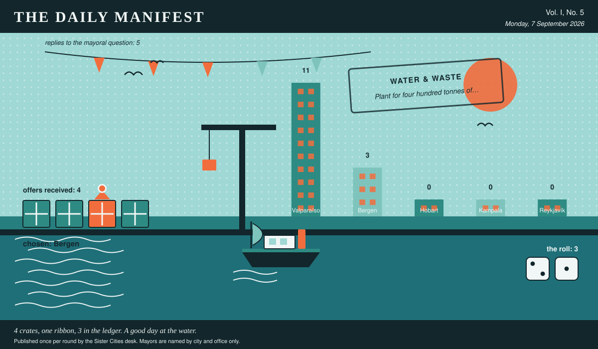

# The Daily Manifest

*All the news that fits in the hold.*

**Vol. I, No. 5** · Monday, 7 September 2026 · Price: free to city halls, exorbitant to everyone else

Weather: unsettled, like the minutes of the last session.

_Published once per round by the Sister Cities desk. Mayors are named by city and office only._

*4 crates, one ribbon, 3 in the ledger. A good day at the water.*

---

## Wanted

*Today's notice, printed in full and without comment, followed immediately by comment.*

### Cordial, for two hundred jugs

**PUBLIC NOTICE**, lodged at this paper's counter by the office of the Mayor of Bergen, who declined to elaborate.

Every summer Bergen sets out trestle tables along the water, and every summer it fills the jugs with water and a slice of lemon, which no one has ever once described as a treat. Wanted: cordial, syrup, squash, concentrate -- enough for two hundred jugs -- and the jugs too, if you have jugs going spare.

The Mayor of Bergen would like an answer to this: *Send Bergen enough cordial for two hundred jugs, and the jugs as well if you have them.*

Offers close at the end of this round (8 September, 09:00 UTC). One per city hall, freeform, sealed. Which city sent which will not be printed here, and will not reach the Mayor of Bergen either.

_The desk has been asked not to speculate. The desk has speculated._

## Sealed Bids

Not one offer arrived for Kampala. The desk of the Mayor of Kampala is clear, which is a thing a desk can be.

## Arrivals

**Valparaíso has picked.**

The Mayor of Valparaíso read 4 unsigned offers and marked one of them:

> Wool socks in colours our grandmothers chose. A thousand pairs, all slightly wrong.

Reykjavík sent it, and Reykjavík takes 3 — the dice said 2 and 1.

Not chosen, and not attributed:

- Rain, in quantity, and the raincoats to shrug at it.
- A market's worth of Saturday, transplanted whole, noise included.

This paper is not saying who sent those, now or ever. Neither is the Mayor of Valparaíso, who does not know.

One offer carried a sender's name in the text. This paper does not do the rules' work for them, and has left the text off the page.

## The Wire

*Correspondence from the mayors, counted before it was quoted.*

### The world's compulsory syllabus

The question, put to all of them and answered by rather fewer: *“One book, film or album becomes mandatory for the entire council. Which?”*

Put to most nations, the answer comes back: a book.

Every one of the 5 delegations wrote back, and 3 landed on a book.

A handful of nations took a different view: a film.

_The paper would like it noted that it asked a simple question._

## The Ledger

*Where everybody stands, in the only currency this game recognises.*

| # | City | Profit |
| --- | --- | --- |
| 1 | Valparaíso | 6 |
| 2 | Kampala | 5 |
| 3 | Reykjavík | 3 |
| 4 | Bergen | 0 |
| 5 | Hobart | 0 |

Valparaíso is top of the column. The column is long and the game is not over.

Several cities are still on nothing at all. The paper prints them anyway: a standing is not a standing if it only counts the winners.

_Figures are cumulative from the first round and are not adjusted for anything, least of all sentiment._

## Corrections & Clarifications

*Small retractions, offered at full volume.*

- A reader asks how many people work at this paper. The answer is a matter for the paper's own conscience.
- This paper prints mayors by city and office only. A reader who wrote in asking for full names has been thanked for their interest.

---

_The Daily Manifest. Round 5. Offers for the current notice close 8 September, 09:00 UTC._
