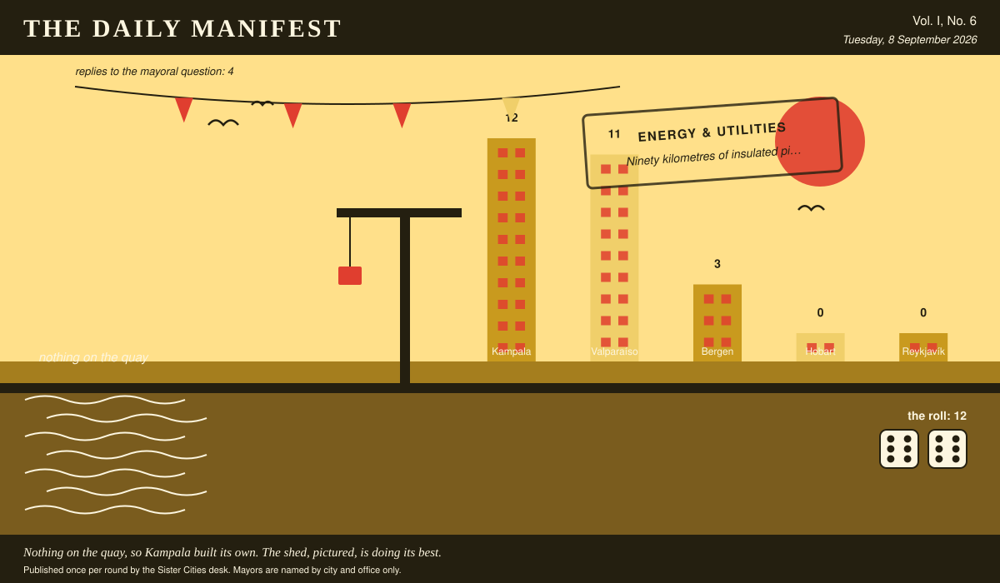

# The Daily Manifest

*All the news that fits in the hold.*

**Vol. I, No. 6** · Tuesday, 8 September 2026 · Price: whatever you have in the coat you wore yesterday

Weather: unsettled, like the minutes of the last session.

_Published once per round by the Sister Cities desk. Mayors are named by city and office only._

*Nothing on the quay, so Kampala built its own. The shed, pictured, is doing its best.*

---

## Wanted

*The classifieds desk has been busy. It has taken one advertisement.*

### Four hundred hot water bottles, and the covers for them

**PUBLIC NOTICE**, filed by the Mayor of Reykjavík under Small Comforts, which is where Reykjavík files most things.

It is dark in Reykjavík by two in the afternoon for most of December, and the flats at the top of the hill are cold in a way that no amount of tea has ever settled. Wanted: hot water bottles -- four hundred, rubber, boring, the kind that outlive their owners -- knitted covers for all of them, and two hundred pairs of thick socks in case the covers run short.

The office asks, and the paper repeats verbatim: *Ship Reykjavík four hundred hot water bottles and the covers for them, and say what the covers are knitted from.*

Every other city hall may send exactly one offer, in whatever form it likes, by 9 September, 09:00 UTC. The offers arrive unsigned, and the Mayor of Reykjavík will read them that way.

_The paper's position on a wet Tuesday is that somebody should be sent for biscuits, and it will not be the paper._

## Sealed Bids

Four offers are now on the desk of the Mayor of Bergen, stacked in an order this paper drew from a hat and will not be explaining.

This paper knows exactly as much about who sent what as the Mayor of Bergen does, which is nothing, and it intends to keep the record clean.

One round to decide. A window that closes without a decision is not a disaster, merely an expensive kind of politeness.

## Arrivals

**Kampala does it itself.**

The postbag for Kampala was empty. The Mayor of Kampala has responded by declaring the matter a domestic industry and getting on with it.

This paper has been shown the premises and would describe them as premises.

The profit stands at 12 (6 and 6). Self-reliance is, in this economy, fully reimbursed.

## The Wire

*Correspondence from the mayors, counted before it was quoted.*

### What the world doesn't get

The question, put to all of them and answered by rather fewer: *“Name a thing everybody else loves that you have never understood.”*

Most nations: brunch.

4 of 5 city halls wrote back. 3 of those said brunch.

One lone municipality answered simply: “Golf. All of it.” — the Mayor of Hobart.

_The paper considers the matter open and expects correspondence._

## The Ledger

*Cumulative profit by city, as recorded by this paper's accountants, who are volunteers and say so often.*

| # | City | Profit |
| --- | --- | --- |
| 1 | Kampala | 17 |
| 2 | Valparaíso | 6 |
| 3 | Reykjavík | 3 |
| 4 | Bergen | 0 |
| 5 | Hobart | 0 |

Kampala is top of the column. The column is long and the game is not over.

Several cities are still on nothing at all. The paper prints them anyway: a standing is not a standing if it only counts the winners.

_Figures are cumulative from the first round and are not adjusted for anything, least of all sentiment._

## Corrections & Clarifications

*Small retractions, offered at full volume.*

- This paper has been referring throughout to 'the round of notices'. It is now obliged to concede that there is a second one, and that this is it. Rotation 2 begins.
- The Wire item above rests on 4 replies out of 5 city halls. The paper prefers to say so in two places than in none.

---

_The Daily Manifest. Round 6. Offers for the current notice close 9 September, 09:00 UTC._
