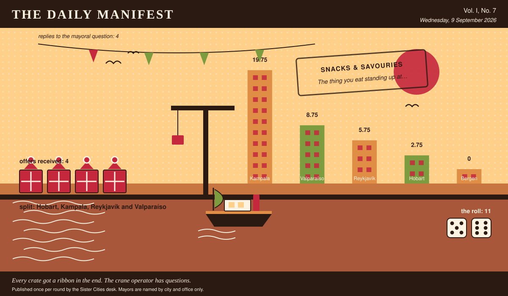

# The Daily Manifest

*All the news that fits in the hold.*

**Vol. I, No. 7** · Wednesday, 9 September 2026 · Price: whatever you have in the coat you wore yesterday

Weather: overcast, with a strong chance of committee.

_Published once per round by the Sister Cities desk. Mayors are named by city and office only._

*Every crate got a ribbon in the end. The crane operator has questions.*

---

## Wanted

*One city wants something. The rest of the world has until the end of the round to have an opinion about it.*

### An explanation for the humming

**PUBLIC NOTICE**, lodged at this paper's counter by the office of the Mayor of Hobart, who declined to elaborate.

Since February, Hobart has hummed. Two residents in five can hear it. The utility says it isn't theirs, the geologists say it isn't the ground, and the council has begun describing it in writing as 'the ambience.'

The Mayor of Hobart would like an answer to this: *Explain Hobart's hum, or make it somebody's problem in a way that helps.*

Offers close at the end of this round (10 September, 09:00 UTC). One per city hall, freeform, sealed. Which city sent which will not be printed here, and will not reach the Mayor of Hobart either.

_The desk has been asked not to speculate. The desk has speculated._

## Sealed Bids

4 sealed offers, one desk, and the Mayor of Reykjavík sitting behind the lot of it.

The offers are unsigned. That is not the paper being coy; it is the rule, and it holds after the vote as firmly as before it.

One round to decide. A window that closes without a decision is not a disaster, merely an expensive kind of politeness.

## Arrivals

**The window closed with nobody chosen.**

The Mayor of Bergen's picking window closed with the offers still spread across the desk. The rules are unsentimental about this: every offer submitted is declared a winner.

11 (5 and 6), split 4 ways: Hobart, Kampala, Reykjavík and Valparaíso take 2.75 apiece.

The offers, the Mayor of Bergen assures us, were impossible to choose between. The dice found it straightforward.

## The Wire

*Correspondence from the mayors, counted before it was quoted.*

### What the world is burying

The question, put to all of them and answered by rather fewer: *“Your city is burying a time capsule. What do you put in it personally?”*

No two nations agree. The answers in full: a personal object, a recording, food and something civic.

4 replies from 5 asked, and not enough agreement anywhere to point at.

A single delegation answered simply: “A funicular ticket, punched.” — the Mayor of Valparaíso.

Exactly one city hall — the Mayor of Kampala — wrote only this: “A recording of the market at seven in the morning.”

And then one lone municipality, from the Mayor of Hobart: “A jar of jam and the recipe for the jam.”

_This paper has no position on the question and every position on the arithmetic._

## The Ledger

*Where everybody stands, in the only currency this game recognises.*

| # | City | Profit |
| --- | --- | --- |
| 1 | Kampala | 14.75 |
| 2 | Valparaíso | 13.75 |
| 3 | Bergen | 3 |
| 4 | Hobart | 2.75 |
| 5 | Reykjavík | 2.75 |

Kampala leads, and has been gracious about it in a way this paper found slightly worse than gloating.

_Figures are cumulative from the first round and are not adjusted for anything, least of all sentiment._

## Corrections & Clarifications

*The paper's errors, reported with the gravity they deserve and then some.*

- The Wire item above rests on 4 replies out of 5 city halls. The paper prefers to say so in two places than in none.
- The masthead reads Vol. I, No. 7. There has never been a Vol. II and there is no plan for one.

---

_The Daily Manifest. Round 7. Offers for the current notice close 10 September, 09:00 UTC._
