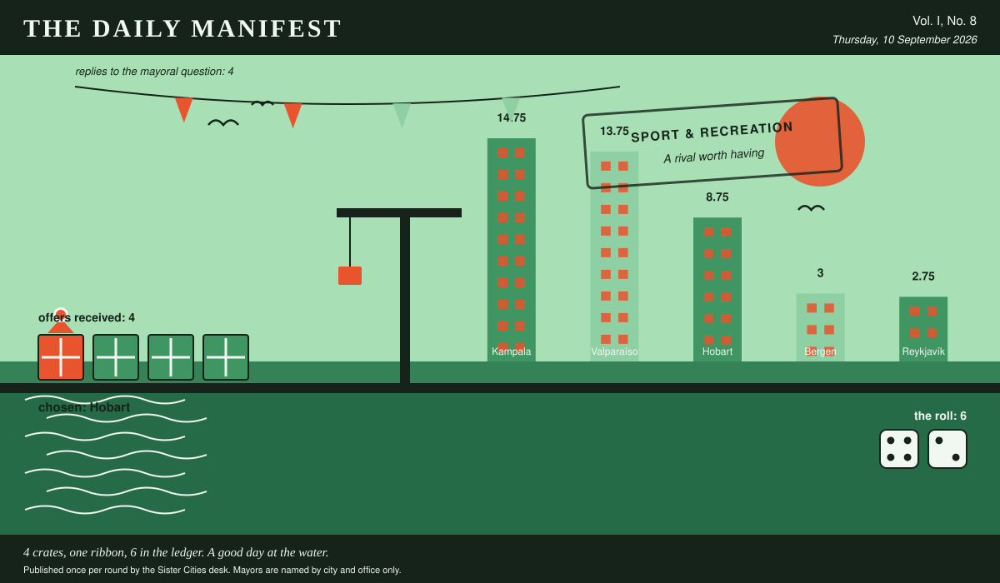

# The Daily Manifest

*All the news that fits in the hold.*

**Vol. I, No. 8** · Thursday, 10 September 2026 · Price: settled at the counter, in produce if necessary

Weather: clear enough to see the other side, which is new.

_Published once per round by the Sister Cities desk. Mayors are named by city and office only._

*4 crates, one ribbon, 6 in the ledger. A good day at the water.*

---

## Wanted

*One city wants something. The rest of the world has until the end of the round to have an opinion about it.*

### A rival worth having

**PUBLIC NOTICE**. The Mayor of Valparaíso has taken out an advertisement. This paper has read it three times and remains impressed.

Valparaíso's team has no traditional rival. Matches are cordial. Attendance is stable. Something essential is missing and everyone is too polite to name it.

The office asks, and the paper repeats verbatim: *Give Valparaíso something or someone to beat.*

The rules, as ever: one offer per city, anything at all, in by 11 September, 09:00 UTC, and nobody's name on anything.

_This paper has no view on the matter and has held that position loudly._

## Sealed Bids

The window on Hobart's notice has closed. Three offers went in. The Mayor of Hobart has them, in a pile, in no order that means anything.

Which city sent which offer is not printed here, is not known to the Mayor of Hobart, and will not be known to anybody at all except in the one case where an offer wins.

The Mayor of Hobart has until the end of this round to choose. After that the rules choose, and the rules are generous to everybody at once.

## Arrivals

**A decision, and promptly.**

From the four sealed offers on the Mayor of Reykjavík's desk, one:

> The southernmost bakery on the register, boxed, with its opening hours.

Hobart sent it, and Hobart takes 6 — the dice said 4 and 2.

Also offered, and declined:

- A fish counter with a two-hundred-year opinion about freshness.
- A rolling programme of unscheduled municipal celebration.
- The complete municipal songbook, including the verses nobody sings.

The paper would dearly love to say more. The paper has rules.

## The Wire

*Correspondence from the mayors, counted before it was quoted.*

### The world and the morning

The question, put to all of them and answered by rather fewer: *“Your honest relationship with mornings, in one sentence.”*

The world is split down the middle: at peace with mornings on one side, at war with mornings on the other, 2 apiece.

4 of 5 city halls replied, and they divided 2 against 2.

_The paper would like it noted that it asked a simple question._

## The Ledger

*The running total. Compiled carefully, printed reluctantly.*

| # | City | Profit |
| --- | --- | --- |
| 1 | Kampala | 14.75 |
| 2 | Valparaíso | 13.75 |
| 3 | Hobart | 8.75 |
| 4 | Bergen | 3 |
| 5 | Reykjavík | 2.75 |

Kampala is top of the column. The column is long and the game is not over.

_Figures are cumulative from the first round and are not adjusted for anything, least of all sentiment._

## Corrections & Clarifications

*The paper's errors, reported with the gravity they deserve and then some.*

- The Wire item above rests on 4 replies out of 5 city halls. The paper prefers to say so in two places than in none.
- An earlier edition credited Bergen with a difficult choice. The choice, in the event, was not made, and the profit was shared out by clock.

---

_The Daily Manifest. Round 8. Offers for the current notice close 11 September, 09:00 UTC._
