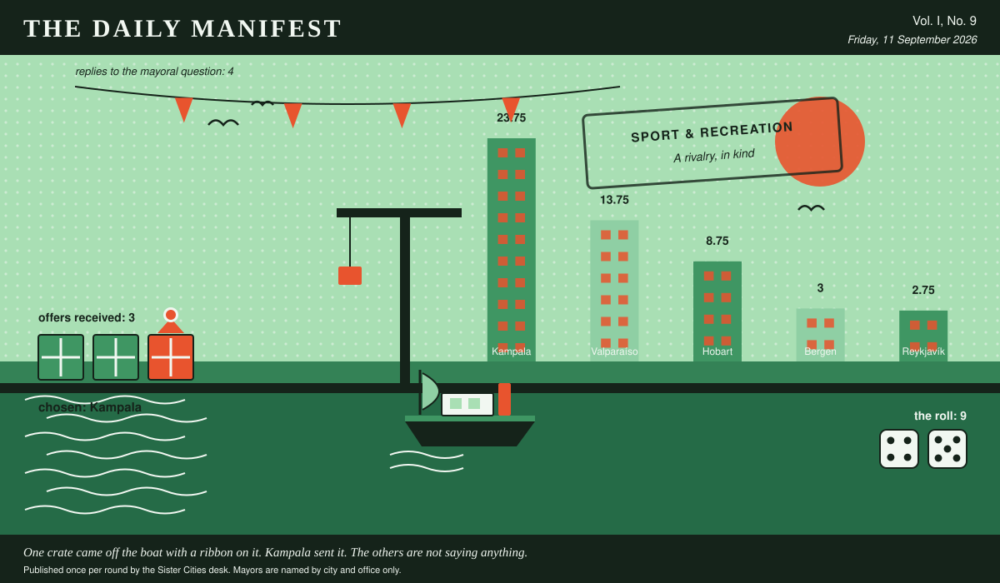

# The Daily Manifest

*All the news that fits in the hold.*

**Vol. I, No. 9** · Friday, 11 September 2026 · Price: unchanged since the first edition, which was also this week

Weather: unsettled, like the minutes of the last session.

_Published once per round by the Sister Cities desk. Mayors are named by city and office only._

*One crate came off the boat with a ribbon on it. Kampala sent it. The others are not saying anything.*

---

## Wanted

*One city wants something. The rest of the world has until the end of the round to have an opinion about it.*

### Prizes for a fête, and nothing sensible

**PUBLIC NOTICE** from Kampala, paid for in goodwill and one packet of biscuits, and printed here at length because the paper had the room.

Kampala's summer fête has eleven stalls and a prize table currently holding a tin of peaches. Wanted: prizes -- plastic, gaudy, faintly baffling -- five hundred of them, plus one single prize so good that grown adults will queue in the rain for a raffle ticket.

The Mayor of Kampala would like an answer to this: *Send Kampala five hundred small gaudy prizes and one absurdly good one, and say which is which.*

The rules, as ever: one offer per city, anything at all, in by 12 September, 09:00 UTC, and nobody's name on anything.

_Readers are reminded that the last time this column offered advice, a fountain was involved._

## Sealed Bids

4 sealed offers, one desk, and the Mayor of Valparaíso sitting behind the lot of it.

Which city sent which offer is not printed here, is not known to the Mayor of Valparaíso, and will not be known to anybody at all except in the one case where an offer wins.

The Mayor of Valparaíso has until the end of this round to choose. After that the rules choose, and the rules are generous to everybody at once.

## Arrivals

**Chosen.**

The winning offer for Hobart, reproduced exactly as it arrived:

> Roast maize, chapati and a spice mix in unlabelled bags, because labels slow everything down.

— *In the Mayor of Kampala's own words, printed exactly as they arrived at this desk.*

It came from Kampala, which takes 9 on the roll (4 and 5).

Also offered, and declined:

- Seven brass instruments, tuned, and a procession route we are prepared to lend.
- A crate of paperbacks about weather, read to destruction over one long winter.

— *Offers in their senders' own words. Whose words they are stays in the envelope, permanently.*

Those arrived unsigned and will stay that way. A losing offer's city is nobody's business, permanently.

## The Wire

*Correspondence from the mayors, counted before it was quoted.*

### The world, awake

The question, put to all of them and answered by rather fewer: *“Longest you have ever gone without sleep — and what were you doing?”*

Every nation on record: looking after somebody.

4 of 5 city halls wrote back. 4 of those said looking after somebody.

_The paper would like it noted that it asked a simple question._

## The Ledger

*Cumulative profit by city, as recorded by this paper's accountants, who are volunteers and say so often.*

| # | City | Profit |
| --- | --- | --- |
| 1 | Kampala | 28.75 |
| 2 | Hobart | 8.75 |
| 3 | Valparaíso | 8.75 |
| 4 | Reykjavík | 5.75 |
| 5 | Bergen | 0 |

Kampala holds the head of the table this round. Tables turn; that is largely what they are for.

A city on zero is still a city. The column includes everybody, which is the point of a column.

_Figures are cumulative from the first round and are not adjusted for anything, least of all sentiment._

## Corrections & Clarifications

*Small retractions, offered at full volume.*

- The Wire item above rests on 4 replies out of 5 city halls. The paper prefers to say so in two places than in none.
- The masthead reads Vol. I, No. 9. There has never been a Vol. II and there is no plan for one.

---

_The Daily Manifest. Round 9. Offers for the current notice close 12 September, 09:00 UTC._
