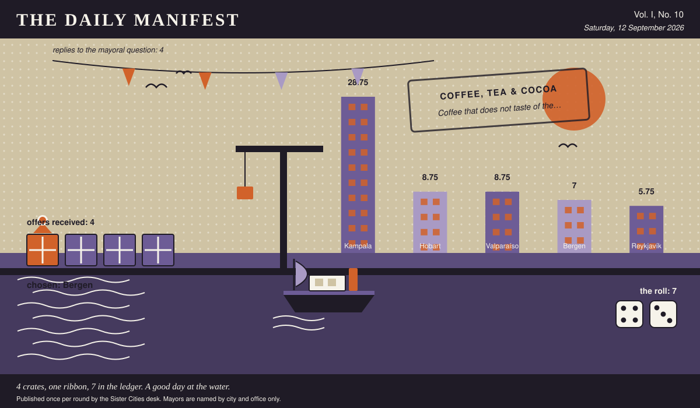

# The Daily Manifest

*All the news that fits in the hold.*

**Vol. I, No. 10** · Saturday, 12 September 2026 · Price: unchanged since the first edition, which was also this week

Weather: fog. The ferries are running on confidence alone.

_Published once per round by the Sister Cities desk. Mayors are named by city and office only._

*4 crates, one ribbon, 7 in the ledger. A good day at the water.*

---

## Wanted

*One city wants something. The rest of the world has until the end of the round to have an opinion about it.*

### Stock a library card is worth having for

**PUBLIC NOTICE**, lodged at this paper's counter by the office of the Mayor of Bergen, who declined to elaborate.

Bergen's library is free, excellent, and holds active cards for 8% of residents. The librarians have tried posters. The posters were not the issue. Bergen is buying stock and hardware: books nobody else lends, instruments, tools, seeds, a van with shelves in it — anything a card can be used to take home.

The office asks, and the paper repeats verbatim: *Ship Bergen the stock its library lends out, and say what a borrower carries away.*

Every other city hall may send exactly one offer, in whatever form it likes, by 13 September, 09:00 UTC. The offers arrive unsigned, and the Mayor of Bergen will read them that way.

_Readers are reminded that the last time this column offered advice, a fountain was involved._

## Sealed Bids

Four offers are now on the desk of the Mayor of Kampala, stacked in an order this paper drew from a hat and will not be explaining.

This paper knows exactly as much about who sent what as the Mayor of Kampala does, which is nothing, and it intends to keep the record clean.

The Mayor of Kampala has until the end of this round to choose. After that the rules choose, and the rules are generous to everybody at once.

## Arrivals

**Chosen.**

From the four sealed offers on the Mayor of Valparaíso's desk, one:

> A retired harbourmaster, on loan, with strong opinions and a thermos.

The sender, now nameable because they won: Reykjavík. Profit: 7, on 4 and 3.

Not chosen, and not attributed:

- One extremely load-bearing granite step, spare.
- A quiet room with a view of water, available Tuesdays.
- A market's worth of Saturday, transplanted whole, noise included.

The paper would dearly love to say more. The paper has rules.

## The Wire

*The paper puts one question to every city hall each round and prints what comes back, in aggregate, with the arithmetic showing.*

### Delivery preferences of the world

This paper put the same question to every city hall: *“Do you want bad news all at once, or in instalments?”*

Put to a good many countries, the answer comes back: all at once.

4 of 5 city halls wrote back. 2 of those said all at once.

One more, unaccompanied, from the Mayor of Bergen: “In instalments, please. I have to keep working afterwards.”

A single delegation answered simply: “It depends entirely on the news, and I know which when I hear it.” — the Mayor of Valparaíso.

_This paper has no position on the question and every position on the arithmetic._

## The Ledger

*Cumulative profit by city, as recorded by this paper's accountants, who are volunteers and say so often.*

| # | City | Profit |
| --- | --- | --- |
| 1 | Kampala | 23.75 |
| 2 | Valparaíso | 13.75 |
| 3 | Reykjavík | 9.75 |
| 4 | Hobart | 8.75 |
| 5 | Bergen | 3 |

Kampala leads, and has been gracious about it in a way this paper found slightly worse than gloating.

_Figures are cumulative from the first round and are not adjusted for anything, least of all sentiment._

## Corrections & Clarifications

*The paper's errors, reported with the gravity they deserve and then some.*

- The Wire item above rests on 4 replies out of 5 city halls. The paper prefers to say so in two places than in none.
- This paper is called The Daily Manifest and publishes once per round. The two facts are only occasionally the same fact.

---

_The Daily Manifest. Round 10. Offers for the current notice close 13 September, 09:00 UTC._
