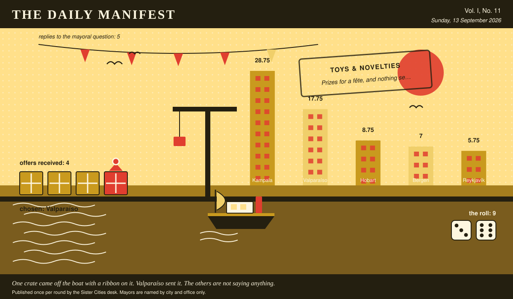

# The Daily Manifest

*All the news that fits in the hold.*

**Vol. I, No. 11** · Sunday, 13 September 2026 · Price: settled at the counter, in produce if necessary

Weather: unsettled, like the minutes of the last session.

_Published once per round by the Sister Cities desk. Mayors are named by city and office only._

*One crate came off the boat with a ribbon on it. Bergen sent it. The others are not saying anything.*

---

## Wanted

*No new notice. The classifieds desk has gone to look at the harbour.*

Nobody wants anything. The paper finds this the most unnerving development of the game so far.

## Sealed Bids

The window on Bergen's notice has closed. Four offers went in. The Mayor of Bergen has them, in a pile, in no order that means anything.

This paper knows exactly as much about who sent what as the Mayor of Bergen does, which is nothing, and it intends to keep the record clean.

One round to decide. A window that closes without a decision is not a disaster, merely an expensive kind of politeness.

## Arrivals

**Chosen.**

From the four sealed offers on the Mayor of Kampala's desk, one:

> Rain. Enormous quantities of rain, and the civic infrastructure to shrug at it.

Bergen sent it, and Bergen takes 9 — the dice said 3 and 6.

Also offered, and declined:

- A ferry timetable that has survived contact with the actual weather.
- Six weeks of the municipal brass band, and the sheet music for one more.

This paper is not saying who sent those, now or ever. Neither is the Mayor of Kampala, who does not know.

One offer matched, sentence for sentence, an offer already printed with its sender named. The paper is not going to pretend it cannot see that, and has left the text out.

## The Wire

*Correspondence from the mayors, counted before it was quoted.*

### What the world keeps for itself

This paper put the same question to every city hall: *“What is the one thing you would never delegate?”*

The world, with one hold-out: the apology.

All 5 city halls replied, and 4 of them named the apology.

A single delegation — the Mayor of Valparaíso — wrote only this: “Bad news. I deliver it myself or it isn't delivered.”

_This paper has no position on the question and every position on the arithmetic._

## The Ledger

*Cumulative profit by city, as recorded by this paper's accountants, who are volunteers and say so often.*

| # | City | Profit |
| --- | --- | --- |
| 1 | Kampala | 23.75 |
| 2 | Valparaíso | 13.75 |
| 3 | Bergen | 12 |
| 4 | Reykjavík | 9.75 |
| 5 | Hobart | 8.75 |

Kampala is top of the column. The column is long and the game is not over.

_Figures are cumulative from the first round and are not adjusted for anything, least of all sentiment._

## Corrections & Clarifications

*Small retractions, offered at full volume.*

- A reader asks how many people work at this paper. The answer is a matter for the paper's own conscience.
- This paper prints mayors by city and office only. A reader who wrote in asking for full names has been thanked for their interest.

---

_The Daily Manifest. Round 11. Offers for the current notice close 14 September, 09:00 UTC._
