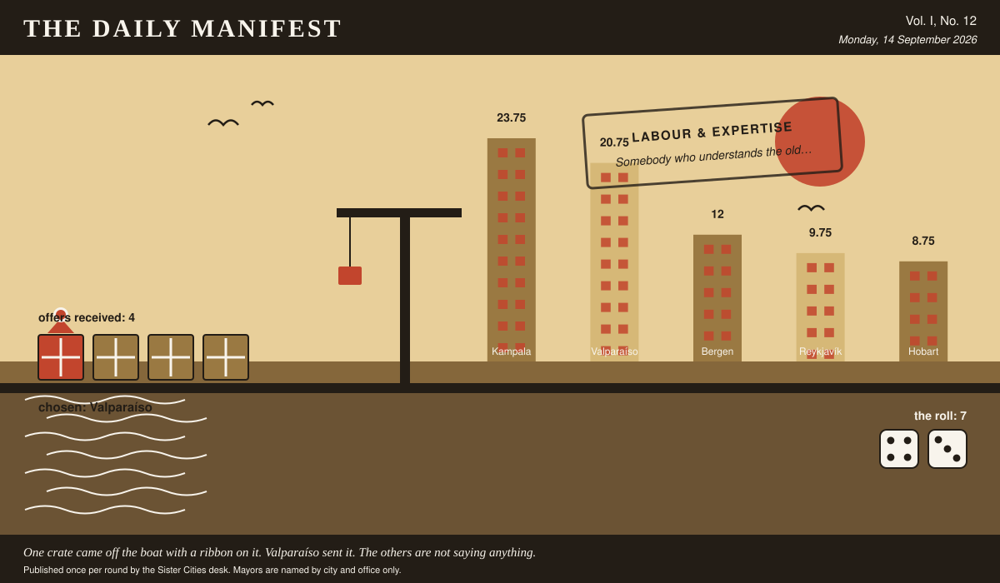

# The Daily Manifest

*All the news that fits in the hold.*

**Vol. I, No. 12** · Monday, 14 September 2026 · Price: unchanged since the first edition, which was also this week

Weather: wind from the harbour, opinions from everywhere.

_Published once per round by the Sister Cities desk. Mayors are named by city and office only._

*One crate came off the boat with a ribbon on it. Valparaíso sent it. The others are not saying anything.*

---

## Wanted

*The Wanted column is empty today, for the first time since this paper was founded, which was recently.*

Every city on the register has had its turn to want something. The paper has checked the list twice and can find nobody left to ask.

## Sealed Bids

No window closed today. The offers currently in transit remain in transit.

## Arrivals

**Chosen.**

The winning offer for Bergen, reproduced exactly as it arrived:

> A hillside's worth of paint, in colours the council will argue about for years.

Valparaíso sent it, and Valparaíso takes 7 — the dice said 4 and 3.

Three offers matched, sentence for sentence, an offer already printed with its sender named. The paper is not going to pretend it cannot see that, and has left the text out.

## The Wire

*Correspondence from the mayors, counted before it was quoted.*

### Correspondence received

This paper put the same question to every city hall: *“If your city vanished overnight, where would you go?”*

The postbag was empty. The paper has re-read the question and concedes it may have been a lot to ask on a busy round.

_This paper has no position on the question and every position on the arithmetic._

## The Ledger

*Cumulative profit by city, as recorded by this paper's accountants, who are volunteers and say so often.*

| # | City | Profit |
| --- | --- | --- |
| 1 | Kampala | 23.75 |
| 2 | Valparaíso | 20.75 |
| 3 | Bergen | 12 |
| 4 | Reykjavík | 9.75 |
| 5 | Hobart | 8.75 |

Kampala leads, and has been gracious about it in a way this paper found slightly worse than gloating.

_Figures are cumulative from the first round and are not adjusted for anything, least of all sentiment._

## Corrections & Clarifications

*Small retractions, offered at full volume.*

- The masthead reads Vol. I, No. 12. There has never been a Vol. II and there is no plan for one.
- A reader asks how many people work at this paper. The answer is a matter for the paper's own conscience.

---

_The Daily Manifest. Round 12. Offers for the current notice close 15 September, 09:00 UTC._
